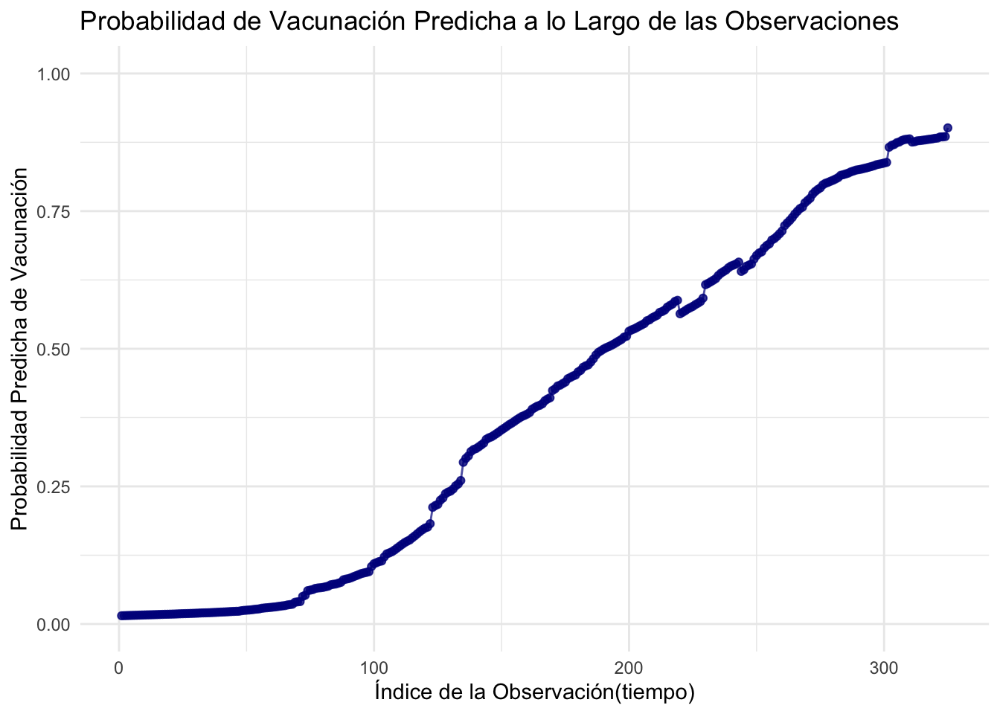

2025-05-16


::: {style="text-align: left;"}
**Zamora, T. Jesús D**[^1]  
[thowinssonj@uninorte.edu.co](mailto:thowinssonj@uninorte.edu.co)  

**Melendez, A. Gregory J**[^2]  
[gjmelendez@uninorte.edu.co](mailto:gjmelendez@uninorte.edu.co)  
:::

::: {style="text-align: center;"}
Barranquilla-Colombia.
:::

[^1]: *Jesús David Zamora Thowinsson*. Economista y Administrador Público, Especialista en Estadística Aplicada, Candidato a Magíster Scientiarum en Gerencia Empresarial, Magíster en Estadística Aplicada Universidad del Norte.

[^2]: *Gregory Jesús Melendez Alvarez*. Economista, Especialista en Estadística Aplicada, Magíster en Estadística Aplicada Universidad del Norte.


```{=html}
<iframe src="globo.html" width="80%" height="300" style="border:none;"></iframe>
```


```{=html}
<style>
  #TOC::before {
    content: "";
    display: block;
    width: 100%;
    background-image: url('Imagen_portada.png');
    background-size: cover;
    background-repeat: no-repeat;
    background-position: center;
    margin-bottom: 20px;
    border-radius: 10px;
    height: 250px; /* Ajusta la altura según tu imagen */
  }
</style>
```

::: {#toc-imagen-container}

:::

::: {style="text-align: left;"}
#  Resumen
::: 

::: {style="text-align: justify;"}
La tasa de vacunación es un indicador clave en el ámbito de la salud pública debido a su impacto directo en la prevención de enfermedades. Su importancia radica en que no solo protege a los individuos vacunados, sino que también genera un efecto positivo a nivel comunitario, contribuyendo al control y erradicación de diversas enfermedades infecciosas. Una alta tasa de vacunación reduce significativamente la carga sobre los sistemas de salud, al disminuir la prevalencia de enfermedades transmisibles, lo que a su vez disminuye los costos asociados a su tratamiento y hospitalización. Además, mejora la calidad de vida de las personas al prevenir complicaciones graves y potenciales muertes prematuras. La cobertura universal de vacunas también favorece la construcción de "inmunidad colectiva", protegiendo a los individuos más vulnerables que no pueden recibir la vacuna debido a condiciones médicas. La vacunación, por tanto, juega un papel crucial en el logro de los objetivos globales de salud pública establecidos por organismos internacionales, como la Organización Mundial de la Salud (OMS). En resumen, la tasa de vacunación es una herramienta fundamental para la promoción de la salud, la sostenibilidad de los sistemas sanitarios y la mejora del bienestar de las comunidades a nivel global.
:::

# Introducción

::: {style="text-align: justify;"}
La tasa de vacunación es crucial por diversas razones que impactan tanto la salud pública como la economía y el bienestar social. A continuación, te proporciono una estructura detallada sobre su importancia:

1. Prevención de Enfermedades Infecciosas
La tasa de vacunación es un factor clave en la prevención de enfermedades infecciosas. Al aumentar la cobertura de vacunación, se reduce la propagación de virus y bacterias, lo que ayuda a prevenir brotes y epidemias. Esto es especialmente importante para enfermedades como la poliomielitis, el sarampión, la rubéola, y más recientemente, el COVID-19.

Inmunidad colectiva: Cuando un porcentaje suficiente de la población está vacunada, se crea lo que se conoce como inmunidad colectiva o de rebaño. Esto significa que incluso aquellos que no pueden recibir la vacuna, como personas con condiciones de salud preexistentes o alérgicas, están protegidos indirectamente debido a la baja circulación del patógeno.

2. Reducción de la Mortalidad y Morbilidad
Las vacunas han sido responsables de la reducción significativa en las tasas de mortalidad y morbilidad de diversas enfermedades. La tasa de vacunación alta está directamente relacionada con una menor cantidad de muertes y complicaciones derivadas de enfermedades prevenibles por vacunación.

Reducción de hospitalizaciones: Las personas vacunadas son menos propensas a desarrollar formas graves de enfermedades, lo que reduce la presión sobre los sistemas de salud y los hospitales, especialmente durante brotes o pandemias.

3. Costos en Salud Pública
Una alta tasa de vacunación no solo mejora la salud pública, sino que también reduce los costos relacionados con la atención médica. Esto incluye el tratamiento de enfermedades graves, hospitalizaciones, y los costos de los programas de salud pública que se necesitarían para controlar brotes. Las vacunas, al ser más baratas que el tratamiento de enfermedades graves, representan una inversión económica en la salud a largo plazo.

4. Eliminación de Enfermedades y Erradicación de Patógenos
En algunos casos, una alta tasa de vacunación ha llevado a la erradicación de enfermedades. El ejemplo más destacado es la erradicación de la viruela, y más recientemente, la drástica reducción de casos de polio en muchas partes del mundo. La eliminación de patógenos por medio de la vacunación no solo salva vidas, sino que también reduce la carga en los sistemas de salud a nivel global.

5. Protección a Poblaciones Vulnerables
Al mantener altas tasas de vacunación, se protege especialmente a las poblaciones vulnerables, como los niños, los ancianos, y las personas con sistemas inmunitarios comprometidos. Estas personas son más propensas a desarrollar enfermedades graves y, por lo tanto, se benefician directamente de una alta tasa de vacunación en la comunidad.

6. Fomentar la Confianza en las Vacunas
Una alta tasa de vacunación también ayuda a fomentar la confianza en los programas de vacunación y en las políticas de salud pública. Cuando las personas ven que las vacunas son efectivas y seguras, se sienten más inclinadas a vacunarse, lo que mejora aún más las tasas de cobertura.

7. Impacto Global en la Salud
A nivel global, las altas tasas de vacunación son esenciales para controlar enfermedades infecciosas transnacionales y evitar pandemias. Programas internacionales como los promovidos por la Organización Mundial de la Salud (OMS) trabajan para aumentar la cobertura de vacunación en todo el mundo, especialmente en países de ingresos bajos y medios.
:::

# Metodologia

::: {style="text-align: justify;"}

Los datos de la tasa de vacunación contra el COVID‑19 utilizados en este análisis provienen de la plataforma **Our World in Data**, específicamente de la sección denominada **“Coronavirus (COVID‑19) Vaccinations**” y del repositorio correspondiente en GitHub. Estas series temporales están construidas a partir de información oficial suministrada por los gobiernos y ministerios de salud de cada país, incluidos datos de dosis administradas, personas vacunadas y poblaciones totales [ourworldindata.org](https://ourworldindata.org/covid-vaccinations?utm_source=chatgpt.com)

La metodología de **Our World in Data** consiste en extraer, estandarizar y procesar diariamente los datos brutos, armonizando nombres geográficos, unidades y fechas, y calculando indicadores derivados, como la proporción de la población vacunada [ourworldindata.org](https://ourworldindata.org/covid-vaccinations?utm_source=chatgpt.com). Las cifras de población provienen de la División de Población de las Naciones Unidas, lo que permite normalizar las tasas de cobertura vacunal de forma coherente.

En particular, los datos referentes a Colombia incluyen:

- Número diario y acumulado de dosis administradas
- Número de personas con al menos una dosis o esquema completo
- Población estimada usada para calcular proporciones

Estos registros se actualizan al día y están disponibles para descarga directa desde archivos CSV en el repositorio “owid/covid‑19‑data” de GitHub, lo que garantiza transparencia, trazabilidad y reproducibilidad del análisis [ourworldindata.org](https://ourworldindata.org/covid-vaccinations?utm_source=chatgpt.com).

En este estudio se explicará cómo funciona el modelo beta en el contexto de un modelo lineal generalizado (GLM), utilizando la tasa de vacunación como ejemplo para una variable dependiente. Se detallará la media esperada $(\mu)$ y su cálculo utilizando la función de enlace logit.

### Supuestos del Modelo

La variable dependiente $(y_i)$ (tasa de vacunación) está en el intervalo $(0, 1)$.

$$
y_i \sim \text{Beta}(\mu_i, \phi)
$$
Donde:

-   $(\mu_i \in (0, 1))$: es la media de la tasa de vacunación para el individuo o grupo (i).
-   $(\phi > 0)$: es el parámetro de precisión (similar a una inversa de la varianza).

### Modelo Lineal sobre la Media (con Función de Enlace Logit)

Usamos la función de enlace logit para mapear la media $(\mu_i \in (0, 1))$ al espacio real:

$$
\text{logit}(\mu_i) = \log\left(\frac{\mu_i}{1 - \mu_i}\right) = \eta_i = \beta_0 + \beta_1 x_{1i} + \beta_2 x_{2i} + \beta_3 x_{3i} + \beta_4 x_{4i}
$$
Entonces:

$$
\mu_i = \frac{1}{1 + e^{-(\beta_0 + \beta_1 x_{1i} + \dots + \beta_4 x_{4i})}}
$$

### ¿Qué Representa Cada Cosa?

-   $(y_i)$: tasa de vacunación observada.
-   $(\mu_i)$: valor esperado de la tasa de vacunación dado $(x_1, x_2, x_3, x_4)$.
-   $(\beta_0, \dots, \beta_4)$: coeficientes a estimar.
-   $(x_{1i}, \dots, x_{4i})$: variables independientes (por ejemplo: edad promedio, nivel educativo, ingresos, acceso a centros de salud).

## Modelo Beta: Parametrización
 
En una regresión beta, se asume que cada $y_i \in (0,1)$ sigue una distribución beta con parámetros:
 
$$
y_i \sim \text{Beta}(\mu_i \phi, (1 - \mu_i)\phi)
$$
 
Donde:
 
- La **media** es:  
  $$
  \mathbb{E}[y_i] = \mu_i
  $$
 
- La **varianza** es:  
  $$
  \text{Var}(y_i) = \frac{\mu_i(1 - \mu_i)}{1 + \phi}
  $$
 
### Función de Verosimilitud
 
La función de densidad de una variable beta con parametrización en términos de $\mu_i$ y $\phi$ es:
 
$$
f(y_i; \mu_i, \phi) = \frac{\Gamma(\phi)}{\Gamma(\mu_i \phi)\Gamma((1 - \mu_i)\phi)} y_i^{\mu_i\phi - 1} (1 - y_i)^{(1 - \mu_i)\phi - 1}
$$
 
La función de verosimilitud conjunta para todos los $i$ es el producto de estas densidades, y su log-verosimilitud es:
 
$$
\ell(\mu, \phi) = \sum_{i=1}^n \left[ \log \Gamma(\phi) - \log \Gamma(\mu_i \phi) - \log \Gamma((1 - \mu_i)\phi) + (\mu_i \phi - 1)\log y_i + ((1 - \mu_i)\phi - 1)\log (1 - y_i) \right]
$$
 
 
### Estimación de $\phi$
 
Para estimar $\phi$, se toma la derivada de la log-verosimilitud con respecto a $\phi$, y se iguala a cero:
 
$$
\frac{\partial \ell}{\partial \phi} = 0
$$
 
Esto implica derivadas de la función gamma, que se expresan mediante la **función digamma**:
 
$$
\psi(x) = \frac{d}{dx} \log \Gamma(x)
$$
 
Entonces se obtiene la siguiente ecuación:
 
$$
\sum_{i=1}^n \left[ \psi(\phi) - \mu_i \psi(\mu_i \phi) - (1 - \mu_i) \psi((1 - \mu_i)\phi) + \mu_i \log y_i + (1 - \mu_i) \log(1 - y_i) \right] = 0
$$

 
### Conclusión
 
- No puedes aislar $\phi$ en una fórmula simple.
- Depende de todos los valores $y_i$ y $\mu_i$.
- Involucra funciones especiales (gamma, digamma).
- Se estima resolviendo la ecuación numéricamente mediante algoritmos como **Newton-Raphson** o **BFGS**.

## Varianza del Modelo

La varianza de $(y_i)$ en un modelo Beta no es constante (como en regresión lineal):

$$
\text{Var}(y_i) = \frac{\mu_i (1 - \mu_i)}{1 + \phi}
$$

Entonces, cuanto mayor es $(\phi)$, menor es la varianza alrededor de $(\mu_i)$.

### ¿Qué significa que $(\phi > 0)$?

En el modelo Beta, el parámetro $(\phi)$ (llamado precisión o dispersión inversa) siempre es positivo:

$$
\phi > 0
$$
-   No puede ser cero.
-   No puede ser negativo.

### ¿Cómo afecta a la forma de la distribución?

La varianza de una variable Beta se calcula de la siguiente manera:

$$
\text{Var}(y) = \frac{\mu (1 - \mu)}{1 + \phi}
$$

### Valor de $(\phi)$ y su impacto en la varianza:

| **Valor de $(\phi)$ | **¿Qué pasa con la varianza?** | **¿Qué significa?** |
|------------------------|-----------------------------|--------------------|
| Muy bajo (ej. 1) | Varianza alta | Alta dispersión: los valores de  $(y)$ están bien esparcidos entre 0 y 1. |
| Moderado (ej. 10) | Varianza media | Los valores de $(y)$ comienzan a concentrarse más alrededor de $(\mu)$. |
| Alto (ej. 100 o más) | Varianza baja | Alta precisión: casi todos los valores de $(y)$ están muy cerca de $(\mu)$. |

### Explicación de la tabla:

-   $\phi$ muy bajo: Esto implica que hay una alta dispersión en los valores de la tasa de vacunación, lo que significa que los valores de yyy (tasa de vacunación) están más distribuidos a lo largo del intervalo (0,1)(0, 1)(0,1).

    $\phi$ moderado: A medida que $\phi$ aumenta, los valores de yyy tienden a concentrarse más alrededor de la media μ\muμ, reduciendo la dispersión.

    $\phi$ alto: Un $\phi$ alto indica una alta precisión, es decir, la mayoría de los valores de yyy están muy cerca de la media μ\muμ.

### Interpretación de $(\phi)$ en el Modelo Beta

-   $(\phi)$ pequeño (por ejemplo, $(\phi \approx 1))$
    Los datos son más dispersos alrededor de la media. Las observaciones tienen mayor variabilidad.

-   $(\phi)$ moderado (por ejemplo, $(\phi \approx 5 \text{ o } 10)$
    Hay una dispersión moderada. Los datos no están excesivamente dispersos, pero tampoco están demasiado concentrados alrededor de la media.

-   $(\phi)$ grande (por ejemplo, $(\phi > 10)$
    Los datos son más concentrados alrededor de la media. Las observaciones están muy cerca de $(\mu)$, lo que indica menos variabilidad.
:::

# Resultados


::: {.cell layout-align="center"}

```{.r .cell-code}
library(readxl)

# Definir la ruta al archivo Excel
ruta_archivo <- "/Users/instructorzamora/Documents/3_Maestria_Estadistica_UNINORTE/3_Tercer_Semestre/Advanced_Statistics/Tasa_Vacun/owid-covid-data.xlsx"

# Cargar el archivo Excel en un data frame
datos <- read_excel(ruta_archivo)

# Verificar las primeras filas del dataset
head(datos)
```

::: {.cell-output-display}
`````{=html}
<div data-pagedtable="false">
  <script data-pagedtable-source type="application/json">
{"columns":[{"label":["iso_code"],"name":[1],"type":["chr"],"align":["left"]},{"label":["continent"],"name":[2],"type":["chr"],"align":["left"]},{"label":["location"],"name":[3],"type":["chr"],"align":["left"]},{"label":["date"],"name":[4],"type":["chr"],"align":["left"]},{"label":["total_cases"],"name":[5],"type":["dbl"],"align":["right"]},{"label":["new_cases"],"name":[6],"type":["dbl"],"align":["right"]},{"label":["new_cases_smoothed"],"name":[7],"type":["dbl"],"align":["right"]},{"label":["total_deaths"],"name":[8],"type":["dbl"],"align":["right"]},{"label":["new_deaths"],"name":[9],"type":["dbl"],"align":["right"]},{"label":["new_deaths_smoothed"],"name":[10],"type":["dbl"],"align":["right"]},{"label":["total_cases_per_million"],"name":[11],"type":["dbl"],"align":["right"]},{"label":["new_cases_per_million"],"name":[12],"type":["dbl"],"align":["right"]},{"label":["new_cases_smoothed_per_million"],"name":[13],"type":["dbl"],"align":["right"]},{"label":["total_deaths_per_million"],"name":[14],"type":["dbl"],"align":["right"]},{"label":["new_deaths_per_million"],"name":[15],"type":["dbl"],"align":["right"]},{"label":["new_deaths_smoothed_per_million"],"name":[16],"type":["dbl"],"align":["right"]},{"label":["reproduction_rate"],"name":[17],"type":["dbl"],"align":["right"]},{"label":["icu_patients"],"name":[18],"type":["lgl"],"align":["right"]},{"label":["icu_patients_per_million"],"name":[19],"type":["lgl"],"align":["right"]},{"label":["hosp_patients"],"name":[20],"type":["lgl"],"align":["right"]},{"label":["hosp_patients_per_million"],"name":[21],"type":["lgl"],"align":["right"]},{"label":["weekly_icu_admissions"],"name":[22],"type":["lgl"],"align":["right"]},{"label":["weekly_icu_admissions_per_million"],"name":[23],"type":["lgl"],"align":["right"]},{"label":["weekly_hosp_admissions"],"name":[24],"type":["lgl"],"align":["right"]},{"label":["weekly_hosp_admissions_per_million"],"name":[25],"type":["lgl"],"align":["right"]},{"label":["total_tests"],"name":[26],"type":["dbl"],"align":["right"]},{"label":["new_tests"],"name":[27],"type":["lgl"],"align":["right"]},{"label":["total_tests_per_thousand"],"name":[28],"type":["dbl"],"align":["right"]},{"label":["new_tests_per_thousand"],"name":[29],"type":["lgl"],"align":["right"]},{"label":["new_tests_smoothed"],"name":[30],"type":["dbl"],"align":["right"]},{"label":["new_tests_smoothed_per_thousand"],"name":[31],"type":["dbl"],"align":["right"]},{"label":["positive_rate"],"name":[32],"type":["dbl"],"align":["right"]},{"label":["tests_per_case"],"name":[33],"type":["dbl"],"align":["right"]},{"label":["tests_units"],"name":[34],"type":["chr"],"align":["left"]},{"label":["total_vaccinations"],"name":[35],"type":["dbl"],"align":["right"]},{"label":["people_vaccinated"],"name":[36],"type":["dbl"],"align":["right"]},{"label":["people_fully_vaccinated"],"name":[37],"type":["dbl"],"align":["right"]},{"label":["total_boosters"],"name":[38],"type":["lgl"],"align":["right"]},{"label":["new_vaccinations"],"name":[39],"type":["dbl"],"align":["right"]},{"label":["new_vaccinations_smoothed"],"name":[40],"type":["dbl"],"align":["right"]},{"label":["total_vaccinations_per_hundred"],"name":[41],"type":["dbl"],"align":["right"]},{"label":["people_vaccinated_per_hundred"],"name":[42],"type":["dbl"],"align":["right"]},{"label":["people_fully_vaccinated_per_hundred"],"name":[43],"type":["dbl"],"align":["right"]},{"label":["total_boosters_per_hundred"],"name":[44],"type":["lgl"],"align":["right"]},{"label":["new_vaccinations_smoothed_per_million"],"name":[45],"type":["dbl"],"align":["right"]},{"label":["new_people_vaccinated_smoothed"],"name":[46],"type":["dbl"],"align":["right"]},{"label":["new_people_vaccinated_smoothed_per_hundred"],"name":[47],"type":["dbl"],"align":["right"]},{"label":["stringency_index"],"name":[48],"type":["dbl"],"align":["right"]},{"label":["population_density"],"name":[49],"type":["dbl"],"align":["right"]},{"label":["median_age"],"name":[50],"type":["dbl"],"align":["right"]},{"label":["aged_65_older"],"name":[51],"type":["dbl"],"align":["right"]},{"label":["aged_70_older"],"name":[52],"type":["dbl"],"align":["right"]},{"label":["gdp_per_capita"],"name":[53],"type":["dbl"],"align":["right"]},{"label":["extreme_poverty"],"name":[54],"type":["lgl"],"align":["right"]},{"label":["cardiovasc_death_rate"],"name":[55],"type":["dbl"],"align":["right"]},{"label":["diabetes_prevalence"],"name":[56],"type":["dbl"],"align":["right"]},{"label":["female_smokers"],"name":[57],"type":["lgl"],"align":["right"]},{"label":["male_smokers"],"name":[58],"type":["lgl"],"align":["right"]},{"label":["handwashing_facilities"],"name":[59],"type":["dbl"],"align":["right"]},{"label":["hospital_beds_per_thousand"],"name":[60],"type":["dbl"],"align":["right"]},{"label":["life_expectancy"],"name":[61],"type":["dbl"],"align":["right"]},{"label":["human_development_index"],"name":[62],"type":["dbl"],"align":["right"]},{"label":["population"],"name":[63],"type":["dbl"],"align":["right"]},{"label":["excess_mortality_cumulative_absolute"],"name":[64],"type":["lgl"],"align":["right"]},{"label":["excess_mortality_cumulative"],"name":[65],"type":["lgl"],"align":["right"]},{"label":["excess_mortality"],"name":[66],"type":["lgl"],"align":["right"]},{"label":["excess_mortality_cumulative_per_million"],"name":[67],"type":["lgl"],"align":["right"]}],"data":[{"1":"AFG","2":"Asia","3":"Afghanistan","4":"2020-01-05","5":"0","6":"0","7":"NA","8":"0","9":"0","10":"NA","11":"0","12":"0","13":"NA","14":"0","15":"0","16":"NA","17":"NA","18":"NA","19":"NA","20":"NA","21":"NA","22":"NA","23":"NA","24":"NA","25":"NA","26":"NA","27":"NA","28":"NA","29":"NA","30":"NA","31":"NA","32":"NA","33":"NA","34":"NA","35":"NA","36":"NA","37":"NA","38":"NA","39":"NA","40":"NA","41":"NA","42":"NA","43":"NA","44":"NA","45":"NA","46":"NA","47":"NA","48":"0","49":"54.42","50":"18.6","51":"2.58","52":"1.34","53":"1803.99","54":"NA","55":"597.03","56":"9.59","57":"NA","58":"NA","59":"37.75","60":"0.5","61":"64.83","62":"0.51","63":"41128772","64":"NA","65":"NA","66":"NA","67":"NA"},{"1":"AFG","2":"Asia","3":"Afghanistan","4":"2020-01-06","5":"0","6":"0","7":"NA","8":"0","9":"0","10":"NA","11":"0","12":"0","13":"NA","14":"0","15":"0","16":"NA","17":"NA","18":"NA","19":"NA","20":"NA","21":"NA","22":"NA","23":"NA","24":"NA","25":"NA","26":"NA","27":"NA","28":"NA","29":"NA","30":"NA","31":"NA","32":"NA","33":"NA","34":"NA","35":"NA","36":"NA","37":"NA","38":"NA","39":"NA","40":"NA","41":"NA","42":"NA","43":"NA","44":"NA","45":"NA","46":"NA","47":"NA","48":"0","49":"54.42","50":"18.6","51":"2.58","52":"1.34","53":"1803.99","54":"NA","55":"597.03","56":"9.59","57":"NA","58":"NA","59":"37.75","60":"0.5","61":"64.83","62":"0.51","63":"41128772","64":"NA","65":"NA","66":"NA","67":"NA"},{"1":"AFG","2":"Asia","3":"Afghanistan","4":"2020-01-07","5":"0","6":"0","7":"NA","8":"0","9":"0","10":"NA","11":"0","12":"0","13":"NA","14":"0","15":"0","16":"NA","17":"NA","18":"NA","19":"NA","20":"NA","21":"NA","22":"NA","23":"NA","24":"NA","25":"NA","26":"NA","27":"NA","28":"NA","29":"NA","30":"NA","31":"NA","32":"NA","33":"NA","34":"NA","35":"NA","36":"NA","37":"NA","38":"NA","39":"NA","40":"NA","41":"NA","42":"NA","43":"NA","44":"NA","45":"NA","46":"NA","47":"NA","48":"0","49":"54.42","50":"18.6","51":"2.58","52":"1.34","53":"1803.99","54":"NA","55":"597.03","56":"9.59","57":"NA","58":"NA","59":"37.75","60":"0.5","61":"64.83","62":"0.51","63":"41128772","64":"NA","65":"NA","66":"NA","67":"NA"},{"1":"AFG","2":"Asia","3":"Afghanistan","4":"2020-01-08","5":"0","6":"0","7":"NA","8":"0","9":"0","10":"NA","11":"0","12":"0","13":"NA","14":"0","15":"0","16":"NA","17":"NA","18":"NA","19":"NA","20":"NA","21":"NA","22":"NA","23":"NA","24":"NA","25":"NA","26":"NA","27":"NA","28":"NA","29":"NA","30":"NA","31":"NA","32":"NA","33":"NA","34":"NA","35":"NA","36":"NA","37":"NA","38":"NA","39":"NA","40":"NA","41":"NA","42":"NA","43":"NA","44":"NA","45":"NA","46":"NA","47":"NA","48":"0","49":"54.42","50":"18.6","51":"2.58","52":"1.34","53":"1803.99","54":"NA","55":"597.03","56":"9.59","57":"NA","58":"NA","59":"37.75","60":"0.5","61":"64.83","62":"0.51","63":"41128772","64":"NA","65":"NA","66":"NA","67":"NA"},{"1":"AFG","2":"Asia","3":"Afghanistan","4":"2020-01-09","5":"0","6":"0","7":"NA","8":"0","9":"0","10":"NA","11":"0","12":"0","13":"NA","14":"0","15":"0","16":"NA","17":"NA","18":"NA","19":"NA","20":"NA","21":"NA","22":"NA","23":"NA","24":"NA","25":"NA","26":"NA","27":"NA","28":"NA","29":"NA","30":"NA","31":"NA","32":"NA","33":"NA","34":"NA","35":"NA","36":"NA","37":"NA","38":"NA","39":"NA","40":"NA","41":"NA","42":"NA","43":"NA","44":"NA","45":"NA","46":"NA","47":"NA","48":"0","49":"54.42","50":"18.6","51":"2.58","52":"1.34","53":"1803.99","54":"NA","55":"597.03","56":"9.59","57":"NA","58":"NA","59":"37.75","60":"0.5","61":"64.83","62":"0.51","63":"41128772","64":"NA","65":"NA","66":"NA","67":"NA"},{"1":"AFG","2":"Asia","3":"Afghanistan","4":"2020-01-10","5":"0","6":"0","7":"0","8":"0","9":"0","10":"0","11":"0","12":"0","13":"0","14":"0","15":"0","16":"0","17":"NA","18":"NA","19":"NA","20":"NA","21":"NA","22":"NA","23":"NA","24":"NA","25":"NA","26":"NA","27":"NA","28":"NA","29":"NA","30":"NA","31":"NA","32":"NA","33":"NA","34":"NA","35":"NA","36":"NA","37":"NA","38":"NA","39":"NA","40":"NA","41":"NA","42":"NA","43":"NA","44":"NA","45":"NA","46":"NA","47":"NA","48":"0","49":"54.42","50":"18.6","51":"2.58","52":"1.34","53":"1803.99","54":"NA","55":"597.03","56":"9.59","57":"NA","58":"NA","59":"37.75","60":"0.5","61":"64.83","62":"0.51","63":"41128772","64":"NA","65":"NA","66":"NA","67":"NA"}],"options":{"columns":{"min":{},"max":[10]},"rows":{"min":[10],"max":[10]},"pages":{}}}
  </script>
</div>
`````
:::

```{.r .cell-code}
colnames(datos)
```

::: {.cell-output .cell-output-stdout}

```
 [1] "iso_code"                                  
 [2] "continent"                                 
 [3] "location"                                  
 [4] "date"                                      
 [5] "total_cases"                               
 [6] "new_cases"                                 
 [7] "new_cases_smoothed"                        
 [8] "total_deaths"                              
 [9] "new_deaths"                                
[10] "new_deaths_smoothed"                       
[11] "total_cases_per_million"                   
[12] "new_cases_per_million"                     
[13] "new_cases_smoothed_per_million"            
[14] "total_deaths_per_million"                  
[15] "new_deaths_per_million"                    
[16] "new_deaths_smoothed_per_million"           
[17] "reproduction_rate"                         
[18] "icu_patients"                              
[19] "icu_patients_per_million"                  
[20] "hosp_patients"                             
[21] "hosp_patients_per_million"                 
[22] "weekly_icu_admissions"                     
[23] "weekly_icu_admissions_per_million"         
[24] "weekly_hosp_admissions"                    
[25] "weekly_hosp_admissions_per_million"        
[26] "total_tests"                               
[27] "new_tests"                                 
[28] "total_tests_per_thousand"                  
[29] "new_tests_per_thousand"                    
[30] "new_tests_smoothed"                        
[31] "new_tests_smoothed_per_thousand"           
[32] "positive_rate"                             
[33] "tests_per_case"                            
[34] "tests_units"                               
[35] "total_vaccinations"                        
[36] "people_vaccinated"                         
[37] "people_fully_vaccinated"                   
[38] "total_boosters"                            
[39] "new_vaccinations"                          
[40] "new_vaccinations_smoothed"                 
[41] "total_vaccinations_per_hundred"            
[42] "people_vaccinated_per_hundred"             
[43] "people_fully_vaccinated_per_hundred"       
[44] "total_boosters_per_hundred"                
[45] "new_vaccinations_smoothed_per_million"     
[46] "new_people_vaccinated_smoothed"            
[47] "new_people_vaccinated_smoothed_per_hundred"
[48] "stringency_index"                          
[49] "population_density"                        
[50] "median_age"                                
[51] "aged_65_older"                             
[52] "aged_70_older"                             
[53] "gdp_per_capita"                            
[54] "extreme_poverty"                           
[55] "cardiovasc_death_rate"                     
[56] "diabetes_prevalence"                       
[57] "female_smokers"                            
[58] "male_smokers"                              
[59] "handwashing_facilities"                    
[60] "hospital_beds_per_thousand"                
[61] "life_expectancy"                           
[62] "human_development_index"                   
[63] "population"                                
[64] "excess_mortality_cumulative_absolute"      
[65] "excess_mortality_cumulative"               
[66] "excess_mortality"                          
[67] "excess_mortality_cumulative_per_million"   
```


:::
:::


::: {.cell layout-align="center"}

```{.r .cell-code}
# Crear un data frame con los nombres de las variables y sus descripciones
variables <- data.frame(
  Variable = c("iso_code", "continent", "location", "date", "total_cases", 
               "new_cases", "new_cases_smoothed", "total_deaths", "new_deaths", 
               "new_deaths_smoothed", "total_cases_per_million", "new_cases_per_million", 
               "new_cases_smoothed_per_million", "total_deaths_per_million", 
               "new_deaths_per_million", "new_deaths_smoothed_per_million", 
               "reproduction_rate", "icu_patients", "icu_patients_per_million", 
               "hosp_patients", "hosp_patients_per_million", "weekly_icu_admissions", 
               "weekly_icu_admissions_per_million", "weekly_hosp_admissions", 
               "weekly_hosp_admissions_per_million", "total_tests", "new_tests", 
               "total_tests_per_thousand", "new_tests_per_thousand", 
               "new_tests_smoothed", "new_tests_smoothed_per_thousand", "positive_rate", 
               "tests_per_case", "tests_units", "total_vaccinations", "people_vaccinated", 
               "people_fully_vaccinated", "total_boosters", "new_vaccinations", 
               "new_vaccinations_smoothed", "total_vaccinations_per_hundred", 
               "people_vaccinated_per_hundred", "people_fully_vaccinated_per_hundred", 
               "total_boosters_per_hundred", "new_vaccinations_smoothed_per_million", 
               "new_people_vaccinated_smoothed", "new_people_vaccinated_smoothed_per_hundred", 
               "stringency_index", "population_density", "median_age", "aged_65_older", 
               "aged_70_older", "gdp_per_capita", "extreme_poverty", "cardiovasc_death_rate", 
               "diabetes_prevalence", "female_smokers", "male_smokers", "handwashing_facilities", 
               "hospital_beds_per_thousand", "life_expectancy", "human_development_index", 
               "population", "excess_mortality_cumulative_absolute", 
               "excess_mortality_cumulative", "excess_mortality", 
               "excess_mortality_cumulative_per_million"),
  Descripción = c("Código del país o región según el estándar ISO", 
                  "Continente al que pertenece el país o región", 
                  "Nombre del país o región", 
                  "Fecha de la observación", 
                  "Total de casos confirmados de COVID-19 en el país o región", 
                  "Nuevos casos confirmados de COVID-19 en el día", 
                  "Promedio de nuevos casos confirmados de COVID-19 suavizados por 7 días", 
                  "Total de muertes confirmadas por COVID-19 en el país o región", 
                  "Nuevas muertes confirmadas por COVID-19 en el día", 
                  "Promedio de nuevas muertes confirmadas de COVID-19 suavizadas por 7 días", 
                  "Total de casos por millón de habitantes", 
                  "Nuevos casos por millón de habitantes", 
                  "Nuevos casos suavizados por millón de habitantes", 
                  "Total de muertes por millón de habitantes", 
                  "Nuevas muertes por millón de habitantes", 
                  "Nuevas muertes suavizadas por millón de habitantes", 
                  "Tasa de reproducción del virus", 
                  "Número de pacientes en unidades de cuidados intensivos (UCI)", 
                  "Número de pacientes en UCI por millón de habitantes", 
                  "Número de pacientes hospitalizados", 
                  "Número de pacientes hospitalizados por millón de habitantes", 
                  "Nuevas admisiones a UCI por semana", 
                  "Nuevas admisiones a UCI por millón de habitantes por semana", 
                  "Nuevas admisiones a hospitales por semana", 
                  "Nuevas admisiones a hospitales por millón de habitantes por semana", 
                  "Total de pruebas realizadas para detectar COVID-19", 
                  "Nuevas pruebas realizadas en el día", 
                  "Total de pruebas por cada mil habitantes", 
                  "Nuevas pruebas por cada mil habitantes", 
                  "Nuevas pruebas suavizadas por 7 días", 
                  "Nuevas pruebas suavizadas por mil habitantes", 
                  "Tasa de resultados positivos entre las pruebas realizadas", 
                  "Número de pruebas realizadas por cada caso confirmado", 
                  "Unidad de medida de las pruebas", 
                  "Total de personas vacunadas", 
                  "Total de personas que han recibido al menos una dosis de la vacuna", 
                  "Total de personas completamente vacunadas", 
                  "Total de dosis de refuerzo administradas", 
                  "Nuevas personas vacunadas en el día", 
                  "Nuevas personas vacunadas suavizadas por 7 días", 
                  "Total de vacunaciones por cada 100 personas", 
                  "Personas vacunadas por cada 100 personas", 
                  "Personas completamente vacunadas por cada 100 personas", 
                  "Dosis de refuerzo por cada 100 personas", 
                  "Nuevas vacunaciones suavizadas por millón de habitantes", 
                  "Nuevas personas vacunadas suavizadas por 7 días", 
                  "Nuevas personas vacunadas suavizadas por 100 personas", 
                  "Índice de severidad de las medidas de restricción COVID-19", 
                  "Densidad de población (habitantes por km²)", 
                  "Edad media de la población", 
                  "Porcentaje de la población de 65 años o más", 
                  "Porcentaje de la población de 70 años o más", 
                  "Producto Interno Bruto (PIB) per cápita", 
                  "Porcentaje de la población que vive en pobreza extrema", 
                  "Tasa de mortalidad por enfermedades cardiovasculares", 
                  "Prevalencia de diabetes en la población", 
                  "Porcentaje de mujeres que fuman", 
                  "Porcentaje de hombres que fuman", 
                  "Porcentaje de población con acceso a instalaciones para lavarse las manos", 
                  "Número de camas de hospital por cada mil habitantes", 
                  "Esperanza de vida promedio en años", 
                  "Índice de desarrollo humano (IDH)", 
                  "Población total del país o región", 
                  "Mortalidad excesiva acumulada en términos absolutos", 
                  "Mortalidad excesiva acumulada en términos relativos", 
                  "Mortalidad excesiva en el periodo", 
                  "Mortalidad excesiva acumulada por millón de habitantes")
)

# Mostrar la tabla con las variables y sus descripciones
knitr::kable(variables, caption = "Significado de las Variables")
```

::: {.cell-output-display}


Table: Significado de las Variables

|Variable                                   |Descripción                                                               |
|:------------------------------------------|:-------------------------------------------------------------------------|
|iso_code                                   |Código del país o región según el estándar ISO                            |
|continent                                  |Continente al que pertenece el país o región                              |
|location                                   |Nombre del país o región                                                  |
|date                                       |Fecha de la observación                                                   |
|total_cases                                |Total de casos confirmados de COVID-19 en el país o región                |
|new_cases                                  |Nuevos casos confirmados de COVID-19 en el día                            |
|new_cases_smoothed                         |Promedio de nuevos casos confirmados de COVID-19 suavizados por 7 días    |
|total_deaths                               |Total de muertes confirmadas por COVID-19 en el país o región             |
|new_deaths                                 |Nuevas muertes confirmadas por COVID-19 en el día                         |
|new_deaths_smoothed                        |Promedio de nuevas muertes confirmadas de COVID-19 suavizadas por 7 días  |
|total_cases_per_million                    |Total de casos por millón de habitantes                                   |
|new_cases_per_million                      |Nuevos casos por millón de habitantes                                     |
|new_cases_smoothed_per_million             |Nuevos casos suavizados por millón de habitantes                          |
|total_deaths_per_million                   |Total de muertes por millón de habitantes                                 |
|new_deaths_per_million                     |Nuevas muertes por millón de habitantes                                   |
|new_deaths_smoothed_per_million            |Nuevas muertes suavizadas por millón de habitantes                        |
|reproduction_rate                          |Tasa de reproducción del virus                                            |
|icu_patients                               |Número de pacientes en unidades de cuidados intensivos (UCI)              |
|icu_patients_per_million                   |Número de pacientes en UCI por millón de habitantes                       |
|hosp_patients                              |Número de pacientes hospitalizados                                        |
|hosp_patients_per_million                  |Número de pacientes hospitalizados por millón de habitantes               |
|weekly_icu_admissions                      |Nuevas admisiones a UCI por semana                                        |
|weekly_icu_admissions_per_million          |Nuevas admisiones a UCI por millón de habitantes por semana               |
|weekly_hosp_admissions                     |Nuevas admisiones a hospitales por semana                                 |
|weekly_hosp_admissions_per_million         |Nuevas admisiones a hospitales por millón de habitantes por semana        |
|total_tests                                |Total de pruebas realizadas para detectar COVID-19                        |
|new_tests                                  |Nuevas pruebas realizadas en el día                                       |
|total_tests_per_thousand                   |Total de pruebas por cada mil habitantes                                  |
|new_tests_per_thousand                     |Nuevas pruebas por cada mil habitantes                                    |
|new_tests_smoothed                         |Nuevas pruebas suavizadas por 7 días                                      |
|new_tests_smoothed_per_thousand            |Nuevas pruebas suavizadas por mil habitantes                              |
|positive_rate                              |Tasa de resultados positivos entre las pruebas realizadas                 |
|tests_per_case                             |Número de pruebas realizadas por cada caso confirmado                     |
|tests_units                                |Unidad de medida de las pruebas                                           |
|total_vaccinations                         |Total de personas vacunadas                                               |
|people_vaccinated                          |Total de personas que han recibido al menos una dosis de la vacuna        |
|people_fully_vaccinated                    |Total de personas completamente vacunadas                                 |
|total_boosters                             |Total de dosis de refuerzo administradas                                  |
|new_vaccinations                           |Nuevas personas vacunadas en el día                                       |
|new_vaccinations_smoothed                  |Nuevas personas vacunadas suavizadas por 7 días                           |
|total_vaccinations_per_hundred             |Total de vacunaciones por cada 100 personas                               |
|people_vaccinated_per_hundred              |Personas vacunadas por cada 100 personas                                  |
|people_fully_vaccinated_per_hundred        |Personas completamente vacunadas por cada 100 personas                    |
|total_boosters_per_hundred                 |Dosis de refuerzo por cada 100 personas                                   |
|new_vaccinations_smoothed_per_million      |Nuevas vacunaciones suavizadas por millón de habitantes                   |
|new_people_vaccinated_smoothed             |Nuevas personas vacunadas suavizadas por 7 días                           |
|new_people_vaccinated_smoothed_per_hundred |Nuevas personas vacunadas suavizadas por 100 personas                     |
|stringency_index                           |Índice de severidad de las medidas de restricción COVID-19                |
|population_density                         |Densidad de población (habitantes por km²)                                |
|median_age                                 |Edad media de la población                                                |
|aged_65_older                              |Porcentaje de la población de 65 años o más                               |
|aged_70_older                              |Porcentaje de la población de 70 años o más                               |
|gdp_per_capita                             |Producto Interno Bruto (PIB) per cápita                                   |
|extreme_poverty                            |Porcentaje de la población que vive en pobreza extrema                    |
|cardiovasc_death_rate                      |Tasa de mortalidad por enfermedades cardiovasculares                      |
|diabetes_prevalence                        |Prevalencia de diabetes en la población                                   |
|female_smokers                             |Porcentaje de mujeres que fuman                                           |
|male_smokers                               |Porcentaje de hombres que fuman                                           |
|handwashing_facilities                     |Porcentaje de población con acceso a instalaciones para lavarse las manos |
|hospital_beds_per_thousand                 |Número de camas de hospital por cada mil habitantes                       |
|life_expectancy                            |Esperanza de vida promedio en años                                        |
|human_development_index                    |Índice de desarrollo humano (IDH)                                         |
|population                                 |Población total del país o región                                         |
|excess_mortality_cumulative_absolute       |Mortalidad excesiva acumulada en términos absolutos                       |
|excess_mortality_cumulative                |Mortalidad excesiva acumulada en términos relativos                       |
|excess_mortality                           |Mortalidad excesiva en el periodo                                         |
|excess_mortality_cumulative_per_million    |Mortalidad excesiva acumulada por millón de habitantes                    |


:::
:::


::: {#tbl-clases-filtradas .cell layout-align="center" tbl-cap='Tipos de Variable con Filtro Interactivo por Clase'}

```{.r .cell-code}
# 1. Cargar la librería DT
library(DT)

# 2. Obtenemos las clases de cada variable en un vector
clases <- sapply(datos, class)

# 3. Convertimos el resultado en un data frame
tabla_clases <- data.frame(
  Variable = names(clases),
  Clase = unname(clases),
  row.names = NULL
)

# 4. Creamos la tabla interactiva con el filtro desplegable
datatable(
  tabla_clases,
  filter = 'top', # <-- ¡Esta es la clave para los filtros!
  options = list(pageLength = 10)
)
```

::: {.cell-output-display}

```{=html}
<div class="datatables html-widget html-fill-item" id="htmlwidget-6bbc2c67ea3e229a92ea" style="width:100%;height:auto;"></div>
<script type="application/json" data-for="htmlwidget-6bbc2c67ea3e229a92ea">{"x":{"filter":"top","vertical":false,"filterHTML":"<tr>\n  <td><\/td>\n  <td data-type=\"character\" style=\"vertical-align: top;\">\n    <div class=\"form-group has-feedback\" style=\"margin-bottom: auto;\">\n      <input type=\"search\" placeholder=\"All\" class=\"form-control\" style=\"width: 100%;\"/>\n      <span class=\"glyphicon glyphicon-remove-circle form-control-feedback\"><\/span>\n    <\/div>\n  <\/td>\n  <td data-type=\"character\" style=\"vertical-align: top;\">\n    <div class=\"form-group has-feedback\" style=\"margin-bottom: auto;\">\n      <input type=\"search\" placeholder=\"All\" class=\"form-control\" style=\"width: 100%;\"/>\n      <span class=\"glyphicon glyphicon-remove-circle form-control-feedback\"><\/span>\n    <\/div>\n  <\/td>\n<\/tr>","data":[["1","2","3","4","5","6","7","8","9","10","11","12","13","14","15","16","17","18","19","20","21","22","23","24","25","26","27","28","29","30","31","32","33","34","35","36","37","38","39","40","41","42","43","44","45","46","47","48","49","50","51","52","53","54","55","56","57","58","59","60","61","62","63","64","65","66","67"],["iso_code","continent","location","date","total_cases","new_cases","new_cases_smoothed","total_deaths","new_deaths","new_deaths_smoothed","total_cases_per_million","new_cases_per_million","new_cases_smoothed_per_million","total_deaths_per_million","new_deaths_per_million","new_deaths_smoothed_per_million","reproduction_rate","icu_patients","icu_patients_per_million","hosp_patients","hosp_patients_per_million","weekly_icu_admissions","weekly_icu_admissions_per_million","weekly_hosp_admissions","weekly_hosp_admissions_per_million","total_tests","new_tests","total_tests_per_thousand","new_tests_per_thousand","new_tests_smoothed","new_tests_smoothed_per_thousand","positive_rate","tests_per_case","tests_units","total_vaccinations","people_vaccinated","people_fully_vaccinated","total_boosters","new_vaccinations","new_vaccinations_smoothed","total_vaccinations_per_hundred","people_vaccinated_per_hundred","people_fully_vaccinated_per_hundred","total_boosters_per_hundred","new_vaccinations_smoothed_per_million","new_people_vaccinated_smoothed","new_people_vaccinated_smoothed_per_hundred","stringency_index","population_density","median_age","aged_65_older","aged_70_older","gdp_per_capita","extreme_poverty","cardiovasc_death_rate","diabetes_prevalence","female_smokers","male_smokers","handwashing_facilities","hospital_beds_per_thousand","life_expectancy","human_development_index","population","excess_mortality_cumulative_absolute","excess_mortality_cumulative","excess_mortality","excess_mortality_cumulative_per_million"],["character","character","character","character","numeric","numeric","numeric","numeric","numeric","numeric","numeric","numeric","numeric","numeric","numeric","numeric","numeric","logical","logical","logical","logical","logical","logical","logical","logical","numeric","logical","numeric","logical","numeric","numeric","numeric","numeric","character","numeric","numeric","numeric","logical","numeric","numeric","numeric","numeric","numeric","logical","numeric","numeric","numeric","numeric","numeric","numeric","numeric","numeric","numeric","logical","numeric","numeric","logical","logical","numeric","numeric","numeric","numeric","numeric","logical","logical","logical","logical"]],"container":"<table class=\"display\">\n  <thead>\n    <tr>\n      <th> <\/th>\n      <th>Variable<\/th>\n      <th>Clase<\/th>\n    <\/tr>\n  <\/thead>\n<\/table>","options":{"pageLength":10,"columnDefs":[{"orderable":false,"targets":0},{"name":" ","targets":0},{"name":"Variable","targets":1},{"name":"Clase","targets":2}],"order":[],"autoWidth":false,"orderClasses":false,"orderCellsTop":true}},"evals":[],"jsHooks":[]}</script>
```

:::
:::


# Las Variables Propuestas

::: {style="text-align: justify;"}
La selección de variables es un paso crítico para modelar la tasa de vacunación de manera efectiva. Proponemos una triada de indicadores que, en conjunto, ofrecen una visión integral de los factores que impulsan o limitan el éxito de una campaña de inmunización. Estas variables son:
:::

1. stringency_index (Índice de severidad de las medidas)
2. total_tests (Total de pruebas realizadas para detectar COVID-19)
3. total_deaths (Total de muertes confirmadas por COVID-19 en el país o región)

::: {style="text-align: justify;"}

1. `stringency_index` **(Índice de Severidad de las Medidas)**: Esta variable es crucial porque actúa como un proxy directo de la respuesta gubernamental y las políticas de salud pública. Un índice alto no solo refleja la implementación de medidas como confinamientos o restricciones de movilidad, sino que también indica la capacidad y voluntad del estado para intervenir en la crisis. Estas políticas pueden influir directamente en la vacunación a través de mandatos, campañas de concientización o, por el contrario, restringiendo el acceso si la logística se centra en otras áreas. Por lo tanto, este índice captura el contexto normativo en el que se desarrolla la vacunación.

2. `total_tests` **(Total de Pruebas Realizadas)**: Más que un simple conteo de pruebas, esta variable es un indicador fundamental de la capacidad y la infraestructura del sistema de salud. Un país con la capacidad de realizar un alto volumen de pruebas demuestra tener la red logística, el personal y los sistemas de información necesarios para llevar a cabo otra operación masiva de salud pública: la vacunación. Refleja la visibilidad de la pandemia dentro del país; a mayor número de pruebas, mayor es la conciencia sobre la magnitud del problema, lo que a su vez puede incentivar tanto la acción gubernamental como la demanda de vacunas por parte de la población.

2. `total_deaths` **(Total de Muertes Confirmadas)**: Esta es, quizás, la variable más directa para medir la percepción del riesgo y la urgencia a nivel social. Un número elevado de muertes por COVID-19 impacta de forma contundente la conciencia pública, actuando como un poderoso motivador para que la población busque activamente la vacunación como medida de protección. Además, la presión social y mediática generada por altas tasas de mortalidad suele obligar a los gobiernos a acelerar y priorizar los programas de inmunización. Mide, en esencia, el costo humano de la pandemia, un factor determinante en la demanda de vacunas.

En conclusión, al combinar estas tres variables no solo cubrimos las políticas públicas (stringency_index), la capacidad logística del sistema (total_tests) y la motivación ciudadana (total_deaths), sino que creamos un modelo robusto. Este enfoque nos permite obtener una visión multifacética y precisa de los factores que, en conjunto, explican las variaciones en la tasa de vacunación entre diferentes poblaciones.
:::


::: {.cell layout-align="center"}

```{.r .cell-code}
library(dplyr)
# Filtrar los datos para seleccionar solo Colombia y las variables de interés
nueva_base_datos <- datos %>%
  filter(location == "Colombia") %>%  # Seleccionar solo los datos de Colombia
  select(total_vaccinations_per_hundred, stringency_index,total_tests,total_deaths)  # Seleccionar las variables de interés
 
# Ver las primeras filas de la nueva base de datos
(nueva_base_datos)
```

::: {.cell-output-display}
`````{=html}
<div data-pagedtable="false">
  <script data-pagedtable-source type="application/json">
{"columns":[{"label":["total_vaccinations_per_hundred"],"name":[1],"type":["dbl"],"align":["right"]},{"label":["stringency_index"],"name":[2],"type":["dbl"],"align":["right"]},{"label":["total_tests"],"name":[3],"type":["dbl"],"align":["right"]},{"label":["total_deaths"],"name":[4],"type":["dbl"],"align":["right"]}],"data":[{"1":"NA","2":"0.00","3":"NA","4":"0"},{"1":"NA","2":"0.00","3":"NA","4":"0"},{"1":"NA","2":"0.00","3":"NA","4":"0"},{"1":"NA","2":"0.00","3":"NA","4":"0"},{"1":"NA","2":"0.00","3":"NA","4":"0"},{"1":"NA","2":"0.00","3":"NA","4":"0"},{"1":"NA","2":"0.00","3":"NA","4":"0"},{"1":"NA","2":"0.00","3":"NA","4":"0"},{"1":"NA","2":"0.00","3":"NA","4":"0"},{"1":"NA","2":"0.00","3":"NA","4":"0"},{"1":"NA","2":"0.00","3":"NA","4":"0"},{"1":"NA","2":"0.00","3":"NA","4":"0"},{"1":"NA","2":"0.00","3":"NA","4":"0"},{"1":"NA","2":"0.00","3":"NA","4":"0"},{"1":"NA","2":"0.00","3":"NA","4":"0"},{"1":"NA","2":"0.00","3":"NA","4":"0"},{"1":"NA","2":"8.33","3":"NA","4":"0"},{"1":"NA","2":"8.33","3":"NA","4":"0"},{"1":"NA","2":"8.33","3":"NA","4":"0"},{"1":"NA","2":"8.33","3":"NA","4":"0"},{"1":"NA","2":"8.33","3":"NA","4":"0"},{"1":"NA","2":"8.33","3":"NA","4":"0"},{"1":"NA","2":"8.33","3":"NA","4":"0"},{"1":"NA","2":"8.33","3":"NA","4":"0"},{"1":"NA","2":"8.33","3":"NA","4":"0"},{"1":"NA","2":"8.33","3":"NA","4":"0"},{"1":"NA","2":"8.33","3":"NA","4":"0"},{"1":"NA","2":"8.33","3":"NA","4":"0"},{"1":"NA","2":"8.33","3":"NA","4":"0"},{"1":"NA","2":"8.33","3":"NA","4":"0"},{"1":"NA","2":"8.33","3":"NA","4":"0"},{"1":"NA","2":"8.33","3":"NA","4":"0"},{"1":"NA","2":"8.33","3":"NA","4":"0"},{"1":"NA","2":"8.33","3":"NA","4":"0"},{"1":"NA","2":"8.33","3":"NA","4":"0"},{"1":"NA","2":"8.33","3":"NA","4":"0"},{"1":"NA","2":"8.33","3":"NA","4":"0"},{"1":"NA","2":"8.33","3":"NA","4":"0"},{"1":"NA","2":"8.33","3":"NA","4":"0"},{"1":"NA","2":"8.33","3":"NA","4":"0"},{"1":"NA","2":"8.33","3":"NA","4":"0"},{"1":"NA","2":"8.33","3":"NA","4":"0"},{"1":"NA","2":"8.33","3":"NA","4":"0"},{"1":"NA","2":"8.33","3":"NA","4":"0"},{"1":"NA","2":"8.33","3":"NA","4":"0"},{"1":"NA","2":"8.33","3":"NA","4":"0"},{"1":"NA","2":"8.33","3":"NA","4":"0"},{"1":"NA","2":"8.33","3":"NA","4":"0"},{"1":"NA","2":"8.33","3":"NA","4":"0"},{"1":"NA","2":"8.33","3":"NA","4":"0"},{"1":"NA","2":"12.04","3":"NA","4":"0"},{"1":"NA","2":"12.04","3":"NA","4":"0"},{"1":"NA","2":"12.04","3":"NA","4":"0"},{"1":"NA","2":"12.04","3":"NA","4":"0"},{"1":"NA","2":"12.04","3":"NA","4":"0"},{"1":"NA","2":"12.04","3":"NA","4":"0"},{"1":"NA","2":"12.04","3":"NA","4":"0"},{"1":"NA","2":"12.04","3":"NA","4":"0"},{"1":"NA","2":"12.04","3":"NA","4":"0"},{"1":"NA","2":"12.04","3":"NA","4":"0"},{"1":"NA","2":"12.04","3":"NA","4":"0"},{"1":"NA","2":"12.04","3":"NA","4":"0"},{"1":"NA","2":"12.04","3":"NA","4":"0"},{"1":"NA","2":"12.04","3":"NA","4":"0"},{"1":"NA","2":"14.81","3":"NA","4":"0"},{"1":"NA","2":"14.81","3":"NA","4":"0"},{"1":"NA","2":"14.81","3":"NA","4":"0"},{"1":"NA","2":"34.26","3":"NA","4":"0"},{"1":"NA","2":"34.26","3":"NA","4":"0"},{"1":"NA","2":"34.26","3":"NA","4":"0"},{"1":"NA","2":"34.26","3":"NA","4":"0"},{"1":"NA","2":"45.37","3":"NA","4":"0"},{"1":"NA","2":"50.93","3":"NA","4":"0"},{"1":"NA","2":"50.93","3":"NA","4":"0"},{"1":"NA","2":"50.93","3":"NA","4":"0"},{"1":"NA","2":"50.93","3":"NA","4":"0"},{"1":"NA","2":"50.93","3":"NA","4":"0"},{"1":"NA","2":"50.93","3":"NA","4":"0"},{"1":"NA","2":"53.70","3":"NA","4":"0"},{"1":"NA","2":"53.70","3":"NA","4":"0"},{"1":"NA","2":"87.96","3":"NA","4":"0"},{"1":"NA","2":"87.96","3":"NA","4":"0"},{"1":"NA","2":"87.96","3":"NA","4":"0"},{"1":"NA","2":"87.96","3":"NA","4":"0"},{"1":"NA","2":"87.96","3":"NA","4":"6"},{"1":"NA","2":"87.96","3":"NA","4":"6"},{"1":"NA","2":"87.96","3":"NA","4":"6"},{"1":"NA","2":"87.96","3":"NA","4":"6"},{"1":"NA","2":"87.96","3":"NA","4":"6"},{"1":"NA","2":"87.96","3":"NA","4":"6"},{"1":"NA","2":"87.96","3":"NA","4":"6"},{"1":"NA","2":"87.96","3":"NA","4":"25"},{"1":"NA","2":"87.96","3":"NA","4":"25"},{"1":"NA","2":"87.96","3":"NA","4":"25"},{"1":"NA","2":"87.96","3":"NA","4":"25"},{"1":"NA","2":"87.96","3":"NA","4":"25"},{"1":"NA","2":"87.96","3":"NA","4":"25"},{"1":"NA","2":"87.96","3":"NA","4":"25"},{"1":"NA","2":"87.96","3":"NA","4":"80"},{"1":"NA","2":"87.96","3":"NA","4":"80"},{"1":"NA","2":"84.26","3":"NA","4":"80"},{"1":"NA","2":"84.26","3":"NA","4":"80"},{"1":"NA","2":"84.26","3":"NA","4":"80"},{"1":"NA","2":"84.26","3":"NA","4":"80"},{"1":"NA","2":"84.26","3":"NA","4":"80"},{"1":"NA","2":"84.26","3":"NA","4":"153"},{"1":"NA","2":"84.26","3":"NA","4":"153"},{"1":"NA","2":"84.26","3":"NA","4":"153"},{"1":"NA","2":"84.26","3":"NA","4":"153"},{"1":"NA","2":"84.26","3":"NA","4":"153"},{"1":"NA","2":"87.04","3":"NA","4":"153"},{"1":"NA","2":"87.04","3":"NA","4":"153"},{"1":"NA","2":"87.04","3":"NA","4":"225"},{"1":"NA","2":"90.74","3":"NA","4":"225"},{"1":"NA","2":"90.74","3":"NA","4":"225"},{"1":"NA","2":"90.74","3":"NA","4":"225"},{"1":"NA","2":"90.74","3":"NA","4":"225"},{"1":"NA","2":"90.74","3":"NA","4":"225"},{"1":"NA","2":"90.74","3":"NA","4":"225"},{"1":"NA","2":"90.74","3":"NA","4":"314"},{"1":"NA","2":"90.74","3":"NA","4":"314"},{"1":"NA","2":"90.74","3":"NA","4":"314"},{"1":"NA","2":"87.04","3":"NA","4":"314"},{"1":"NA","2":"87.04","3":"NA","4":"314"},{"1":"NA","2":"87.04","3":"NA","4":"314"},{"1":"NA","2":"87.04","3":"NA","4":"314"},{"1":"NA","2":"87.04","3":"NA","4":"428"},{"1":"NA","2":"87.04","3":"NA","4":"428"},{"1":"NA","2":"87.04","3":"NA","4":"428"},{"1":"NA","2":"87.04","3":"NA","4":"428"},{"1":"NA","2":"87.04","3":"NA","4":"428"},{"1":"NA","2":"87.04","3":"NA","4":"428"},{"1":"NA","2":"87.04","3":"NA","4":"428"},{"1":"NA","2":"87.04","3":"NA","4":"546"},{"1":"NA","2":"87.04","3":"NA","4":"546"},{"1":"NA","2":"87.04","3":"NA","4":"546"},{"1":"NA","2":"87.04","3":"NA","4":"546"},{"1":"NA","2":"87.04","3":"NA","4":"546"},{"1":"NA","2":"87.04","3":"NA","4":"546"},{"1":"NA","2":"87.04","3":"NA","4":"546"},{"1":"NA","2":"87.04","3":"NA","4":"682"},{"1":"NA","2":"87.04","3":"NA","4":"682"},{"1":"NA","2":"87.04","3":"NA","4":"682"},{"1":"NA","2":"87.04","3":"NA","4":"682"},{"1":"NA","2":"87.04","3":"NA","4":"682"},{"1":"NA","2":"87.04","3":"NA","4":"682"},{"1":"NA","2":"87.04","3":"NA","4":"682"},{"1":"NA","2":"87.04","3":"NA","4":"853"},{"1":"NA","2":"87.04","3":"NA","4":"853"},{"1":"NA","2":"87.04","3":"343518","4":"853"},{"1":"NA","2":"87.04","3":"356338","4":"853"},{"1":"NA","2":"87.04","3":"NA","4":"853"},{"1":"NA","2":"87.04","3":"380206","4":"853"},{"1":"NA","2":"87.04","3":"394502","4":"853"},{"1":"NA","2":"87.04","3":"405387","4":"1145"},{"1":"NA","2":"87.04","3":"416415","4":"1145"},{"1":"NA","2":"87.04","3":"428845","4":"1145"},{"1":"NA","2":"87.04","3":"440609","4":"1145"},{"1":"NA","2":"87.04","3":"453862","4":"1145"},{"1":"NA","2":"87.04","3":"465850","4":"1145"},{"1":"NA","2":"87.04","3":"477373","4":"1145"},{"1":"NA","2":"87.04","3":"492735","4":"1545"},{"1":"NA","2":"87.04","3":"505235","4":"1545"},{"1":"NA","2":"87.04","3":"517615","4":"1545"},{"1":"NA","2":"87.04","3":"532782","4":"1545"},{"1":"NA","2":"87.04","3":"548143","4":"1545"},{"1":"NA","2":"87.04","3":"565808","4":"1545"},{"1":"NA","2":"87.04","3":"583220","4":"1545"},{"1":"NA","2":"87.04","3":"601625","4":"2045"},{"1":"NA","2":"87.04","3":"617596","4":"2045"},{"1":"NA","2":"87.04","3":"631467","4":"2045"},{"1":"NA","2":"87.04","3":"648828","4":"2045"},{"1":"NA","2":"87.04","3":"667211","4":"2045"},{"1":"NA","2":"87.04","3":"686028","4":"2045"},{"1":"NA","2":"87.04","3":"705150","4":"2045"},{"1":"NA","2":"87.04","3":"722711","4":"2811"},{"1":"NA","2":"87.04","3":"740309","4":"2811"},{"1":"NA","2":"87.04","3":"757517","4":"2811"},{"1":"NA","2":"87.04","3":"775536","4":"2811"},{"1":"NA","2":"87.04","3":"794644","4":"2811"},{"1":"NA","2":"87.04","3":"815162","4":"2811"},{"1":"NA","2":"87.04","3":"836012","4":"2811"},{"1":"NA","2":"87.04","3":"856975","4":"3777"},{"1":"NA","2":"87.04","3":"877341","4":"3777"},{"1":"NA","2":"87.04","3":"898380","4":"3777"},{"1":"NA","2":"87.04","3":"919712","4":"3777"},{"1":"NA","2":"87.04","3":"940984","4":"3777"},{"1":"NA","2":"87.04","3":"964172","4":"3777"},{"1":"NA","2":"87.04","3":"1001633","4":"3777"},{"1":"NA","2":"87.04","3":"1026714","4":"4925"},{"1":"NA","2":"87.04","3":"1052247","4":"4925"},{"1":"NA","2":"87.04","3":"1077759","4":"4925"},{"1":"NA","2":"87.04","3":"1103443","4":"4925"},{"1":"NA","2":"87.04","3":"1128769","4":"4925"},{"1":"NA","2":"87.04","3":"1154640","4":"4925"},{"1":"NA","2":"87.04","3":"1180985","4":"4925"},{"1":"NA","2":"87.04","3":"1205024","4":"6288"},{"1":"NA","2":"87.04","3":"1231429","4":"6288"},{"1":"NA","2":"87.04","3":"1258404","4":"6288"},{"1":"NA","2":"87.04","3":"1287176","4":"6288"},{"1":"NA","2":"87.04","3":"1315578","4":"6288"},{"1":"NA","2":"87.04","3":"1344008","4":"6288"},{"1":"NA","2":"87.04","3":"1373516","4":"6288"},{"1":"NA","2":"87.04","3":"1403520","4":"7975"},{"1":"NA","2":"87.04","3":"1433785","4":"7975"},{"1":"NA","2":"87.04","3":"1464823","4":"7975"},{"1":"NA","2":"87.04","3":"1496879","4":"7975"},{"1":"NA","2":"87.04","3":"1532478","4":"7975"},{"1":"NA","2":"87.04","3":"1568540","4":"7975"},{"1":"NA","2":"87.04","3":"1604043","4":"7975"},{"1":"NA","2":"87.04","3":"1644196","4":"10105"},{"1":"NA","2":"87.04","3":"1681727","4":"10105"},{"1":"NA","2":"87.04","3":"1720897","4":"10105"},{"1":"NA","2":"87.04","3":"1761402","4":"10105"},{"1":"NA","2":"87.04","3":"1804076","4":"10105"},{"1":"NA","2":"87.04","3":"1847578","4":"10105"},{"1":"NA","2":"87.04","3":"1884182","4":"10105"},{"1":"NA","2":"87.04","3":"1918656","4":"12250"},{"1":"NA","2":"87.04","3":"1954042","4":"12250"},{"1":"NA","2":"87.04","3":"1994778","4":"12250"},{"1":"NA","2":"87.04","3":"2044189","4":"12250"},{"1":"NA","2":"87.04","3":"2088094","4":"12250"},{"1":"NA","2":"87.04","3":"2134206","4":"12250"},{"1":"NA","2":"87.04","3":"2177047","4":"12250"},{"1":"NA","2":"87.04","3":"2217559","4":"14492"},{"1":"NA","2":"87.04","3":"2251822","4":"14492"},{"1":"NA","2":"87.04","3":"2291190","4":"14492"},{"1":"NA","2":"87.04","3":"2329123","4":"14492"},{"1":"NA","2":"87.04","3":"2366615","4":"14492"},{"1":"NA","2":"87.04","3":"2401328","4":"14492"},{"1":"NA","2":"87.04","3":"2441948","4":"14492"},{"1":"NA","2":"87.04","3":"2465827","4":"16568"},{"1":"NA","2":"87.04","3":"2500244","4":"16568"},{"1":"NA","2":"87.04","3":"2537283","4":"16568"},{"1":"NA","2":"87.04","3":"2573632","4":"16568"},{"1":"NA","2":"87.04","3":"2610622","4":"16568"},{"1":"NA","2":"87.04","3":"2645758","4":"16568"},{"1":"NA","2":"87.04","3":"2676156","4":"16568"},{"1":"NA","2":"87.04","3":"2706310","4":"18767"},{"1":"NA","2":"87.04","3":"2736862","4":"18767"},{"1":"NA","2":"71.30","3":"2767368","4":"18767"},{"1":"NA","2":"71.30","3":"2794196","4":"18767"},{"1":"NA","2":"71.30","3":"2828093","4":"18767"},{"1":"NA","2":"71.30","3":"2863922","4":"18767"},{"1":"NA","2":"71.30","3":"2895932","4":"18767"},{"1":"NA","2":"71.30","3":"2923466","4":"20888"},{"1":"NA","2":"71.30","3":"2953998","4":"20888"},{"1":"NA","2":"71.30","3":"2986139","4":"20888"},{"1":"NA","2":"71.30","3":"3017853","4":"20888"},{"1":"NA","2":"71.30","3":"3051748","4":"20888"},{"1":"NA","2":"71.30","3":"3089503","4":"20888"},{"1":"NA","2":"71.30","3":"3121597","4":"20888"},{"1":"NA","2":"71.30","3":"3152624","4":"22518"},{"1":"NA","2":"71.30","3":"3179889","4":"22518"},{"1":"NA","2":"71.30","3":"3201756","4":"22518"},{"1":"NA","2":"71.30","3":"3235593","4":"22518"},{"1":"NA","2":"71.30","3":"3286548","4":"22518"},{"1":"NA","2":"71.30","3":"3320240","4":"22518"},{"1":"NA","2":"71.30","3":"3352438","4":"22518"},{"1":"NA","2":"71.30","3":"3381410","4":"23850"},{"1":"NA","2":"71.30","3":"3412293","4":"23850"},{"1":"NA","2":"71.30","3":"3448251","4":"23850"},{"1":"NA","2":"71.30","3":"3486572","4":"23850"},{"1":"NA","2":"71.30","3":"3521963","4":"23850"},{"1":"NA","2":"71.30","3":"3558371","4":"23850"},{"1":"NA","2":"71.30","3":"3592189","4":"23850"},{"1":"NA","2":"71.30","3":"3623858","4":"25103"},{"1":"NA","2":"71.30","3":"3655039","4":"25103"},{"1":"NA","2":"71.30","3":"3689381","4":"25103"},{"1":"NA","2":"71.30","3":"3724462","4":"25103"},{"1":"NA","2":"71.30","3":"3762648","4":"25103"},{"1":"NA","2":"71.30","3":"3804786","4":"25103"},{"1":"NA","2":"71.30","3":"3847411","4":"25103"},{"1":"NA","2":"71.30","3":"3879746","4":"26397"},{"1":"NA","2":"71.30","3":"3915475","4":"26397"},{"1":"NA","2":"71.30","3":"3952825","4":"26397"},{"1":"NA","2":"71.30","3":"3990171","4":"26397"},{"1":"NA","2":"71.30","3":"4032219","4":"26397"},{"1":"NA","2":"71.30","3":"4081691","4":"26397"},{"1":"NA","2":"71.30","3":"4125939","4":"26397"},{"1":"NA","2":"71.30","3":"4158069","4":"27495"},{"1":"NA","2":"71.30","3":"4186359","4":"27495"},{"1":"NA","2":"71.30","3":"4218942","4":"27495"},{"1":"NA","2":"71.30","3":"4254719","4":"27495"},{"1":"NA","2":"71.30","3":"4298145","4":"27495"},{"1":"NA","2":"71.30","3":"4341158","4":"27495"},{"1":"NA","2":"71.30","3":"4384959","4":"27495"},{"1":"NA","2":"71.30","3":"4416839","4":"28616"},{"1":"NA","2":"65.74","3":"4450268","4":"28616"},{"1":"NA","2":"65.74","3":"4499824","4":"28616"},{"1":"NA","2":"65.74","3":"4546888","4":"28616"},{"1":"NA","2":"65.74","3":"4598286","4":"28616"},{"1":"NA","2":"65.74","3":"4650835","4":"28616"},{"1":"NA","2":"65.74","3":"4701071","4":"28616"},{"1":"NA","2":"65.74","3":"4733902","4":"29802"},{"1":"NA","2":"65.74","3":"4771721","4":"29802"},{"1":"NA","2":"65.74","3":"4820035","4":"29802"},{"1":"NA","2":"65.74","3":"4869039","4":"29802"},{"1":"NA","2":"65.74","3":"4922268","4":"29802"},{"1":"NA","2":"65.74","3":"4973405","4":"29802"},{"1":"NA","2":"65.74","3":"5030456","4":"29802"},{"1":"NA","2":"65.74","3":"5076031","4":"31135"},{"1":"NA","2":"65.74","3":"5106986","4":"31135"},{"1":"NA","2":"65.74","3":"5145037","4":"31135"},{"1":"NA","2":"65.74","3":"5195722","4":"31135"},{"1":"NA","2":"65.74","3":"5238557","4":"31135"},{"1":"NA","2":"65.74","3":"5300983","4":"31135"},{"1":"NA","2":"65.74","3":"5349515","4":"31135"},{"1":"NA","2":"65.74","3":"5382322","4":"32405"},{"1":"NA","2":"65.74","3":"5430786","4":"32405"},{"1":"NA","2":"65.74","3":"5480102","4":"32405"},{"1":"NA","2":"65.74","3":"5528725","4":"32405"},{"1":"NA","2":"65.74","3":"5581509","4":"32405"},{"1":"NA","2":"65.74","3":"5632009","4":"32405"},{"1":"NA","2":"65.74","3":"5687035","4":"32405"},{"1":"NA","2":"65.74","3":"5713384","4":"33669"},{"1":"NA","2":"65.74","3":"5745252","4":"33669"},{"1":"NA","2":"65.74","3":"5783042","4":"33669"},{"1":"NA","2":"65.74","3":"5834338","4":"33669"},{"1":"NA","2":"65.74","3":"5881765","4":"33669"},{"1":"NA","2":"65.74","3":"5933218","4":"33669"},{"1":"NA","2":"65.74","3":"5988285","4":"33669"},{"1":"NA","2":"65.74","3":"6021532","4":"34929"},{"1":"NA","2":"65.74","3":"6060170","4":"34929"},{"1":"NA","2":"65.74","3":"6113266","4":"34929"},{"1":"NA","2":"65.74","3":"6163386","4":"34929"},{"1":"NA","2":"60.19","3":"6222433","4":"34929"},{"1":"NA","2":"60.19","3":"6273520","4":"34929"},{"1":"NA","2":"60.19","3":"6328824","4":"34929"},{"1":"NA","2":"60.19","3":"6368939","4":"36214"},{"1":"NA","2":"60.19","3":"6405449","4":"36214"},{"1":"NA","2":"60.19","3":"6455059","4":"36214"},{"1":"NA","2":"60.19","3":"6509902","4":"36214"},{"1":"NA","2":"60.19","3":"6567364","4":"36214"},{"1":"NA","2":"60.19","3":"6624164","4":"36214"},{"1":"NA","2":"60.19","3":"6676827","4":"36214"},{"1":"NA","2":"60.19","3":"6712172","4":"37467"},{"1":"NA","2":"60.19","3":"6749188","4":"37467"},{"1":"NA","2":"60.19","3":"6788714","4":"37467"},{"1":"NA","2":"60.19","3":"6828810","4":"37467"},{"1":"NA","2":"60.19","3":"6889082","4":"37467"},{"1":"NA","2":"60.19","3":"6942022","4":"37467"},{"1":"NA","2":"60.19","3":"7002361","4":"37467"},{"1":"NA","2":"60.19","3":"7042360","4":"38669"},{"1":"NA","2":"60.19","3":"7095549","4":"38669"},{"1":"NA","2":"60.19","3":"7159016","4":"38669"},{"1":"NA","2":"60.19","3":"7219457","4":"38669"},{"1":"NA","2":"60.19","3":"7283155","4":"38669"},{"1":"NA","2":"60.19","3":"7358160","4":"38669"},{"1":"NA","2":"60.19","3":"7420821","4":"38669"},{"1":"NA","2":"60.19","3":"7464199","4":"40019"},{"1":"NA","2":"60.19","3":"7511550","4":"40019"},{"1":"NA","2":"60.19","3":"7573209","4":"40019"},{"1":"NA","2":"60.19","3":"7652993","4":"40019"},{"1":"NA","2":"60.19","3":"7727149","4":"40019"},{"1":"NA","2":"60.19","3":"7773672","4":"40019"},{"1":"NA","2":"60.19","3":"7805887","4":"40019"},{"1":"NA","2":"60.19","3":"7845374","4":"41690"},{"1":"NA","2":"60.19","3":"7883603","4":"41690"},{"1":"NA","2":"60.19","3":"7953091","4":"41690"},{"1":"NA","2":"60.19","3":"8021229","4":"41690"},{"1":"NA","2":"60.19","3":"8104617","4":"41690"},{"1":"NA","2":"60.19","3":"8143559","4":"41690"},{"1":"NA","2":"60.19","3":"8174365","4":"41690"},{"1":"NA","2":"60.19","3":"8208222","4":"43495"},{"1":"NA","2":"60.19","3":"8256406","4":"43495"},{"1":"NA","2":"60.19","3":"8322055","4":"43495"},{"1":"NA","2":"60.19","3":"8389163","4":"43495"},{"1":"NA","2":"81.02","3":"8457510","4":"43495"},{"1":"NA","2":"81.02","3":"8524185","4":"43495"},{"1":"NA","2":"81.02","3":"8594275","4":"43495"},{"1":"NA","2":"81.02","3":"8649842","4":"45431"},{"1":"NA","2":"81.02","3":"8692928","4":"45431"},{"1":"NA","2":"81.02","3":"8736342","4":"45431"},{"1":"NA","2":"81.02","3":"8794450","4":"45431"},{"1":"NA","2":"81.02","3":"8887583","4":"45431"},{"1":"NA","2":"81.02","3":"8974305","4":"45431"},{"1":"NA","2":"81.02","3":"9044950","4":"45431"},{"1":"NA","2":"81.02","3":"9096536","4":"47868"},{"1":"NA","2":"81.02","3":"9154327","4":"47868"},{"1":"NA","2":"81.02","3":"9229974","4":"47868"},{"1":"NA","2":"81.02","3":"9306456","4":"47868"},{"1":"NA","2":"81.02","3":"9385105","4":"47868"},{"1":"NA","2":"81.02","3":"9470457","4":"47868"},{"1":"NA","2":"81.02","3":"9540474","4":"47868"},{"1":"NA","2":"81.02","3":"9591736","4":"50586"},{"1":"NA","2":"81.02","3":"9651382","4":"50586"},{"1":"NA","2":"81.02","3":"9720861","4":"50586"},{"1":"NA","2":"81.02","3":"9794682","4":"50586"},{"1":"NA","2":"81.02","3":"9867279","4":"50586"},{"1":"NA","2":"81.02","3":"9935192","4":"50586"},{"1":"NA","2":"81.02","3":"10000753","4":"50586"},{"1":"NA","2":"81.02","3":"10057494","4":"53284"},{"1":"NA","2":"81.02","3":"10115267","4":"53284"},{"1":"NA","2":"81.02","3":"10176345","4":"53284"},{"1":"NA","2":"81.02","3":"10238906","4":"53284"},{"1":"NA","2":"81.02","3":"10311358","4":"53284"},{"1":"NA","2":"81.02","3":"10375811","4":"53284"},{"1":"NA","2":"81.02","3":"10430575","4":"53284"},{"1":"NA","2":"81.02","3":"10468478","4":"55403"},{"1":"NA","2":"81.02","3":"10519210","4":"55403"},{"1":"NA","2":"81.02","3":"10566818","4":"55403"},{"1":"NA","2":"81.02","3":"10620148","4":"55403"},{"1":"NA","2":"81.02","3":"10681246","4":"55403"},{"1":"NA","2":"81.02","3":"10735182","4":"55403"},{"1":"NA","2":"81.02","3":"10777897","4":"55403"},{"1":"NA","2":"81.02","3":"10812043","4":"57196"},{"1":"NA","2":"81.02","3":"10852178","4":"57196"},{"1":"NA","2":"81.02","3":"10902549","4":"57196"},{"1":"0.00","2":"81.02","3":"10951888","4":"57196"},{"1":"0.02","2":"81.02","3":"10998131","4":"57196"},{"1":"0.04","2":"81.02","3":"11048103","4":"57196"},{"1":"0.06","2":"81.02","3":"11094314","4":"57196"},{"1":"0.08","2":"81.02","3":"11142831","4":"58511"},{"1":"0.09","2":"81.02","3":"11180513","4":"58511"},{"1":"0.09","2":"81.02","3":"11222217","4":"58511"},{"1":"0.10","2":"81.02","3":"11266013","4":"58511"},{"1":"0.13","2":"81.02","3":"11306422","4":"58511"},{"1":"0.16","2":"81.02","3":"11348446","4":"58511"},{"1":"0.22","2":"81.02","3":"11391151","4":"58511"},{"1":"0.25","2":"81.02","3":"11422582","4":"59518"},{"1":"0.29","2":"81.02","3":"11454722","4":"59518"},{"1":"0.33","2":"81.02","3":"11492372","4":"59518"},{"1":"0.37","2":"81.02","3":"11532349","4":"59518"},{"1":"0.40","2":"81.02","3":"11577615","4":"59518"},{"1":"0.46","2":"81.02","3":"11618498","4":"59518"},{"1":"0.52","2":"81.02","3":"11659216","4":"59518"},{"1":"0.58","2":"81.02","3":"11680862","4":"60300"},{"1":"0.61","2":"81.02","3":"11712220","4":"60300"},{"1":"0.78","2":"81.02","3":"11747474","4":"60300"},{"1":"0.93","2":"81.02","3":"11782943","4":"60300"},{"1":"1.14","2":"81.02","3":"11833612","4":"60300"},{"1":"1.34","2":"81.02","3":"11881588","4":"60300"},{"1":"1.51","2":"81.02","3":"11922524","4":"60300"},{"1":"1.63","2":"81.02","3":"11952837","4":"60950"},{"1":"1.76","2":"81.02","3":"11983805","4":"60950"},{"1":"1.88","2":"81.02","3":"12025525","4":"60950"},{"1":"1.97","2":"81.02","3":"12059588","4":"60950"},{"1":"2.08","2":"81.02","3":"12105604","4":"60950"},{"1":"2.18","2":"81.02","3":"12149590","4":"60950"},{"1":"2.28","2":"81.02","3":"12210290","4":"60950"},{"1":"2.34","2":"81.02","3":"12249183","4":"61771"},{"1":"2.39","2":"81.02","3":"12277309","4":"61771"},{"1":"2.51","2":"81.02","3":"12305901","4":"61771"},{"1":"2.67","2":"81.02","3":"12349517","4":"61771"},{"1":"2.85","2":"81.02","3":"12401610","4":"61771"},{"1":"3.08","2":"81.02","3":"12448098","4":"61771"},{"1":"3.33","2":"81.02","3":"12504795","4":"61771"},{"1":"3.51","2":"81.02","3":"12549134","4":"62645"},{"1":"3.79","2":"81.02","3":"12592062","4":"62645"},{"1":"4.09","2":"81.02","3":"12639232","4":"62645"},{"1":"4.32","2":"81.02","3":"12694994","4":"62645"},{"1":"4.44","2":"81.02","3":"12752612","4":"62645"},{"1":"4.50","2":"81.02","3":"12795981","4":"62645"},{"1":"4.59","2":"81.02","3":"12832239","4":"62645"},{"1":"4.64","2":"81.02","3":"12864840","4":"63777"},{"1":"4.78","2":"79.63","3":"12907039","4":"63777"},{"1":"NA","2":"79.63","3":"12951264","4":"63777"},{"1":"5.19","2":"79.63","3":"13004111","4":"63777"},{"1":"5.42","2":"79.63","3":"13071291","4":"63777"},{"1":"5.68","2":"79.63","3":"13136261","4":"63777"},{"1":"5.86","2":"79.63","3":"13207822","4":"63777"},{"1":"NA","2":"79.63","3":"13275768","4":"65283"},{"1":"6.12","2":"79.63","3":"13328921","4":"65283"},{"1":"6.46","2":"79.63","3":"13400801","4":"65283"},{"1":"6.66","2":"79.63","3":"13488211","4":"65283"},{"1":"NA","2":"79.63","3":"13577238","4":"65283"},{"1":"6.92","2":"79.63","3":"13654476","4":"65283"},{"1":"7.15","2":"79.63","3":"13735876","4":"65283"},{"1":"7.27","2":"79.63","3":"13805840","4":"67564"},{"1":"7.45","2":"79.63","3":"13868449","4":"67564"},{"1":"7.67","2":"79.63","3":"13939379","4":"67564"},{"1":"7.96","2":"79.63","3":"14013383","4":"67564"},{"1":"8.14","2":"79.63","3":"14095309","4":"67564"},{"1":"8.32","2":"79.63","3":"14194065","4":"67564"},{"1":"8.48","2":"79.63","3":"14277419","4":"67564"},{"1":"8.58","2":"79.63","3":"14358523","4":"70446"},{"1":"NA","2":"79.63","3":"14427112","4":"70446"},{"1":"8.92","2":"79.63","3":"14501519","4":"70446"},{"1":"9.09","2":"79.63","3":"14585756","4":"70446"},{"1":"9.30","2":"79.63","3":"14675095","4":"70446"},{"1":"9.61","2":"75.93","3":"14762119","4":"70446"},{"1":"9.86","2":"75.93","3":"14847584","4":"70446"},{"1":"10.06","2":"75.93","3":"14903762","4":"73720"},{"1":"NA","2":"69.44","3":"14959048","4":"73720"},{"1":"NA","2":"69.44","3":"15019338","4":"73720"},{"1":"NA","2":"69.44","3":"15085807","4":"73720"},{"1":"NA","2":"69.44","3":"15160357","4":"73720"},{"1":"11.75","2":"69.44","3":"15242405","4":"73720"},{"1":"NA","2":"69.44","3":"15323787","4":"73720"},{"1":"NA","2":"69.44","3":"15394653","4":"76867"},{"1":"12.49","2":"69.44","3":"15436288","4":"76867"},{"1":"12.86","2":"62.96","3":"15523183","4":"76867"},{"1":"13.21","2":"62.96","3":"15597295","4":"76867"},{"1":"13.58","2":"62.96","3":"15670000","4":"76867"},{"1":"NA","2":"62.96","3":"15741437","4":"76867"},{"1":"14.22","2":"62.96","3":"15821336","4":"76867"},{"1":"14.38","2":"62.96","3":"15882789","4":"80250"},{"1":"14.53","2":"62.96","3":"15915357","4":"80250"},{"1":"14.88","2":"62.96","3":"15956619","4":"80250"},{"1":"15.16","2":"62.96","3":"16032370","4":"80250"},{"1":"15.44","2":"62.96","3":"16103661","4":"80250"},{"1":"NA","2":"62.96","3":"16174084","4":"80250"},{"1":"15.88","2":"62.96","3":"16268389","4":"80250"},{"1":"16.01","2":"62.96","3":"16335336","4":"83719"},{"1":"16.24","2":"62.96","3":"16376107","4":"83719"},{"1":"16.60","2":"62.96","3":"16465726","4":"83719"},{"1":"17.05","2":"62.96","3":"16563365","4":"83719"},{"1":"NA","2":"62.96","3":"16667423","4":"83719"},{"1":"NA","2":"62.96","3":"16748388","4":"83719"},{"1":"18.62","2":"62.96","3":"16834602","4":"83719"},{"1":"18.94","2":"62.96","3":"16913509","4":"87207"},{"1":"19.46","2":"62.96","3":"16964487","4":"87207"},{"1":"20.02","2":"62.96","3":"17055086","4":"87207"},{"1":"20.62","2":"62.96","3":"17163100","4":"87207"},{"1":"21.17","2":"62.96","3":"17259970","4":"87207"},{"1":"21.68","2":"62.96","3":"17357402","4":"87207"},{"1":"22.14","2":"62.96","3":"17455750","4":"87207"},{"1":"22.39","2":"62.96","3":"17527352","4":"90890"},{"1":"22.62","2":"62.96","3":"17579550","4":"90890"},{"1":"23.09","2":"62.96","3":"17643875","4":"90890"},{"1":"23.53","2":"59.26","3":"17753092","4":"90890"},{"1":"NA","2":"59.26","3":"17865464","4":"90890"},{"1":"24.50","2":"59.26","3":"17982770","4":"90890"},{"1":"24.90","2":"59.26","3":"18067758","4":"90890"},{"1":"25.11","2":"59.26","3":"18159504","4":"94615"},{"1":"25.38","2":"59.26","3":"18205176","4":"94615"},{"1":"NA","2":"59.26","3":"18292823","4":"94615"},{"1":"NA","2":"59.26","3":"18403650","4":"94615"},{"1":"27.11","2":"59.26","3":"18510364","4":"94615"},{"1":"NA","2":"59.26","3":"18623558","4":"94615"},{"1":"28.39","2":"59.26","3":"18724777","4":"94615"},{"1":"28.83","2":"59.26","3":"18801159","4":"98746"},{"1":"29.49","2":"59.26","3":"18880824","4":"98746"},{"1":"30.23","2":"59.26","3":"18991604","4":"98746"},{"1":"30.92","2":"59.26","3":"19119385","4":"98746"},{"1":"31.55","2":"59.26","3":"19238762","4":"98746"},{"1":"32.18","2":"59.26","3":"19360226","4":"98746"},{"1":"32.82","2":"59.26","3":"19470666","4":"98746"},{"1":"33.21","2":"59.26","3":"19569875","4":"103321"},{"1":"33.87","2":"59.26","3":"19646098","4":"103321"},{"1":"34.59","2":"59.26","3":"19772875","4":"103321"},{"1":"35.24","2":"59.26","3":"19887032","4":"103321"},{"1":"35.81","2":"59.26","3":"20010139","4":"103321"},{"1":"36.35","2":"59.26","3":"20130214","4":"103321"},{"1":"36.85","2":"59.26","3":"20231810","4":"103321"},{"1":"37.14","2":"59.26","3":"20334215","4":"107723"},{"1":"37.47","2":"59.26","3":"20384574","4":"107723"},{"1":"NA","2":"59.26","3":"20452600","4":"107723"},{"1":"38.94","2":"59.26","3":"20562037","4":"107723"},{"1":"NA","2":"59.26","3":"20660918","4":"107723"},{"1":"NA","2":"59.26","3":"20777100","4":"107723"},{"1":"39.72","2":"53.70","3":"20864103","4":"107723"},{"1":"41.72","2":"53.70","3":"20954957","4":"111731"},{"1":"42.24","2":"53.70","3":"21009016","4":"111731"},{"1":"NA","2":"53.70","3":"21104798","4":"111731"},{"1":"43.61","2":"53.70","3":"21197668","4":"111731"},{"1":"44.23","2":"53.70","3":"21293590","4":"111731"},{"1":"NA","2":"53.70","3":"21387556","4":"111731"},{"1":"45.28","2":"53.70","3":"21480339","4":"111731"},{"1":"45.56","2":"53.70","3":"21559706","4":"115333"},{"1":"45.94","2":"53.70","3":"21602823","4":"115333"},{"1":"46.27","2":"53.70","3":"21691524","4":"115333"},{"1":"NA","2":"53.70","3":"21734323","4":"115333"},{"1":"47.30","2":"53.70","3":"21823553","4":"115333"},{"1":"47.86","2":"53.70","3":"21900388","4":"115333"},{"1":"NA","2":"53.70","3":"21968554","4":"115333"},{"1":"48.87","2":"53.70","3":"22045857","4":"118188"},{"1":"49.43","2":"46.30","3":"22084283","4":"118188"},{"1":"NA","2":"46.30","3":"22164433","4":"118188"},{"1":"50.48","2":"46.30","3":"22229593","4":"118188"},{"1":"51.11","2":"46.30","3":"22319051","4":"118188"},{"1":"NA","2":"46.30","3":"22394557","4":"118188"},{"1":"53.06","2":"46.30","3":"22479769","4":"118188"},{"1":"53.50","2":"46.30","3":"22555987","4":"120432"},{"1":"54.27","2":"46.30","3":"22589809","4":"120432"},{"1":"55.15","2":"46.30","3":"22650682","4":"120432"},{"1":"55.93","2":"46.30","3":"22715694","4":"120432"},{"1":"56.71","2":"46.30","3":"22783450","4":"120432"},{"1":"NA","2":"46.30","3":"22861990","4":"120432"},{"1":"58.30","2":"46.30","3":"22916857","4":"120432"},{"1":"58.56","2":"46.30","3":"22972878","4":"122087"},{"1":"59.07","2":"46.30","3":"23005903","4":"122087"},{"1":"59.54","2":"46.30","3":"23059764","4":"122087"},{"1":"60.05","2":"46.30","3":"23118667","4":"122087"},{"1":"60.49","2":"46.30","3":"23179061","4":"122087"},{"1":"60.83","2":"46.30","3":"23243881","4":"122087"},{"1":"61.24","2":"46.30","3":"23300882","4":"122087"},{"1":"61.43","2":"46.30","3":"23364574","4":"123221"},{"1":"NA","2":"46.30","3":"23390213","4":"123221"},{"1":"62.06","2":"46.30","3":"23425325","4":"123221"},{"1":"62.58","2":"46.30","3":"23475856","4":"123221"},{"1":"63.12","2":"46.30","3":"23532461","4":"123221"},{"1":"63.63","2":"46.30","3":"23592953","4":"123221"},{"1":"64.11","2":"46.30","3":"23646733","4":"123221"},{"1":"64.40","2":"46.30","3":"23700152","4":"124023"},{"1":"64.96","2":"46.30","3":"23733828","4":"124023"},{"1":"65.47","2":"46.30","3":"23776772","4":"124023"},{"1":"66.02","2":"46.30","3":"23828711","4":"124023"},{"1":"NA","2":"46.30","3":"23881781","4":"124023"},{"1":"67.10","2":"46.30","3":"23937265","4":"124023"},{"1":"67.61","2":"46.30","3":"23988579","4":"124023"},{"1":"67.80","2":"46.30","3":"24037809","4":"124648"},{"1":"68.16","2":"46.30","3":"24066701","4":"124648"},{"1":"68.52","2":"46.30","3":"24114775","4":"124648"},{"1":"NA","2":"46.30","3":"24162472","4":"124648"},{"1":"68.92","2":"46.30","3":"24213647","4":"124648"},{"1":"69.57","2":"46.30","3":"24267470","4":"124648"},{"1":"69.85","2":"46.30","3":"24308564","4":"124648"},{"1":"NA","2":"46.30","3":"24354499","4":"125158"},{"1":"NA","2":"46.30","3":"24386485","4":"125158"},{"1":"NA","2":"46.30","3":"24438079","4":"125158"},{"1":"NA","2":"46.30","3":"24491154","4":"125158"},{"1":"71.39","2":"46.30","3":"24542709","4":"125158"},{"1":"71.99","2":"46.30","3":"24596107","4":"125158"},{"1":"NA","2":"46.30","3":"24637757","4":"125158"},{"1":"72.18","2":"46.30","3":"24684753","4":"125529"},{"1":"72.54","2":"46.30","3":"24713540","4":"125529"},{"1":"72.93","2":"46.30","3":"24763289","4":"125529"},{"1":"73.26","2":"46.30","3":"24808973","4":"125529"},{"1":"NA","2":"46.30","3":"24864554","4":"125529"},{"1":"73.89","2":"46.30","3":"24914946","4":"125529"},{"1":"74.11","2":"46.30","3":"24955407","4":"125529"},{"1":"74.25","2":"46.30","3":"25000157","4":"125826"},{"1":"74.57","2":"46.30","3":"25029645","4":"125826"},{"1":"NA","2":"46.30","3":"25079952","4":"125826"},{"1":"75.29","2":"46.30","3":"25127321","4":"125826"},{"1":"75.70","2":"46.30","3":"25177071","4":"125826"},{"1":"NA","2":"46.30","3":"25230437","4":"125826"},{"1":"76.36","2":"46.30","3":"25274638","4":"125826"},{"1":"76.94","2":"46.30","3":"25318223","4":"126068"},{"1":"77.43","2":"46.30","3":"25348650","4":"126068"},{"1":"NA","2":"46.30","3":"25393612","4":"126068"},{"1":"77.89","2":"46.30","3":"25438006","4":"126068"},{"1":"NA","2":"46.30","3":"25489790","4":"126068"},{"1":"79.23","2":"46.30","3":"25538112","4":"126068"},{"1":"NA","2":"46.30","3":"25583408","4":"126068"},{"1":"NA","2":"46.30","3":"25614492","4":"126336"},{"1":"80.05","2":"46.30","3":"25656616","4":"126336"},{"1":"NA","2":"46.30","3":"25694407","4":"126336"},{"1":"81.04","2":"46.30","3":"25739126","4":"126336"},{"1":"81.64","2":"46.30","3":"25788034","4":"126336"},{"1":"82.19","2":"46.30","3":"25839693","4":"126336"},{"1":"82.67","2":"46.30","3":"25882186","4":"126336"},{"1":"82.91","2":"46.30","3":"25915634","4":"126552"},{"1":"83.50","2":"46.30","3":"25954762","4":"126552"},{"1":"84.07","2":"46.30","3":"25996447","4":"126552"},{"1":"84.59","2":"46.30","3":"26044429","4":"126552"},{"1":"85.09","2":"46.30","3":"26092509","4":"126552"},{"1":"85.50","2":"46.30","3":"26137957","4":"126552"},{"1":"NA","2":"46.30","3":"26183257","4":"126552"},{"1":"86.09","2":"46.30","3":"26210517","4":"126796"},{"1":"86.23","2":"46.30","3":"26239165","4":"126796"},{"1":"NA","2":"46.30","3":"26263930","4":"126796"},{"1":"NA","2":"46.30","3":"26302198","4":"126796"},{"1":"NA","2":"46.30","3":"26349031","4":"126796"},{"1":"88.07","2":"46.30","3":"26394615","4":"126796"},{"1":"88.44","2":"46.30","3":"26437758","4":"126796"},{"1":"88.69","2":"46.30","3":"26468456","4":"126994"},{"1":"89.11","2":"46.30","3":"26509571","4":"126994"},{"1":"89.55","2":"46.30","3":"26553280","4":"126994"},{"1":"90.02","2":"46.30","3":"26594370","4":"126994"},{"1":"90.47","2":"46.30","3":"26637577","4":"126994"},{"1":"NA","2":"46.30","3":"26685087","4":"126994"},{"1":"91.16","2":"46.30","3":"26722332","4":"126994"},{"1":"91.38","2":"46.30","3":"26752248","4":"127225"},{"1":"NA","2":"46.30","3":"26788492","4":"127225"},{"1":"92.08","2":"46.30","3":"26814216","4":"127225"},{"1":"92.65","2":"46.30","3":"26854625","4":"127225"},{"1":"93.30","2":"46.30","3":"26895508","4":"127225"},{"1":"NA","2":"46.30","3":"26940596","4":"127225"},{"1":"94.70","2":"46.30","3":"26985357","4":"127225"},{"1":"95.12","2":"46.30","3":"27015962","4":"127456"},{"1":"95.82","2":"46.30","3":"27061940","4":"127456"},{"1":"NA","2":"46.30","3":"27107361","4":"127456"},{"1":"97.42","2":"46.30","3":"27153610","4":"127456"},{"1":"98.15","2":"46.30","3":"27204909","4":"127456"},{"1":"98.92","2":"46.30","3":"27250216","4":"127456"},{"1":"NA","2":"46.30","3":"27292573","4":"127456"},{"1":"99.90","2":"46.30","3":"27336701","4":"127721"},{"1":"100.16","2":"46.30","3":"27371999","4":"127721"},{"1":"100.86","2":"51.43","3":"27408264","4":"127721"},{"1":"101.70","2":"51.41","3":"27453100","4":"127721"},{"1":"102.52","2":"51.38","3":"27500381","4":"127721"},{"1":"103.34","2":"51.36","3":"27552805","4":"127721"},{"1":"104.07","2":"51.34","3":"27592163","4":"127721"},{"1":"104.44","2":"51.33","3":"27633720","4":"128013"},{"1":"105.21","2":"51.30","3":"27687142","4":"128013"},{"1":"105.99","2":"51.28","3":"27730540","4":"128013"},{"1":"106.78","2":"51.26","3":"27782429","4":"128013"},{"1":"NA","2":"51.26","3":"27833471","4":"128013"},{"1":"108.34","2":"51.22","3":"27886578","4":"128013"},{"1":"108.95","2":"46.73","3":"27918068","4":"128013"},{"1":"109.31","2":"46.71","3":"27960329","4":"128343"},{"1":"110.05","2":"46.68","3":"28007231","4":"128343"},{"1":"110.89","2":"46.64","3":"28055048","4":"128343"},{"1":"112.30","2":"46.55","3":"28103011","4":"128343"},{"1":"NA","2":"46.55","3":"28149725","4":"128343"},{"1":"112.95","2":"46.51","3":"28201055","4":"128343"},{"1":"NA","2":"46.51","3":"28235906","4":"128343"},{"1":"113.82","2":"46.46","3":"28272870","4":"128685"},{"1":"114.41","2":"46.41","3":"28324522","4":"128685"},{"1":"114.92","2":"46.38","3":"28373219","4":"128685"},{"1":"NA","2":"46.38","3":"28420533","4":"128685"},{"1":"115.74","2":"46.32","3":"28448279","4":"128685"},{"1":"116.41","2":"46.27","3":"28501606","4":"128685"},{"1":"116.88","2":"46.23","3":"28529827","4":"128685"},{"1":"117.17","2":"46.21","3":"28567153","4":"129011"},{"1":"117.76","2":"46.16","3":"28626141","4":"129011"},{"1":"118.37","2":"50.18","3":"28673869","4":"129011"},{"1":"118.99","2":"50.11","3":"28720320","4":"129011"},{"1":"NA","2":"50.11","3":"28772056","4":"129011"},{"1":"120.13","2":"49.96","3":"28827387","4":"129011"},{"1":"120.53","2":"49.90","3":"28861389","4":"129011"},{"1":"120.75","2":"49.87","3":"28899902","4":"129345"},{"1":"NA","2":"49.87","3":"28949694","4":"129345"},{"1":"NA","2":"49.87","3":"28998098","4":"129345"},{"1":"122.32","2":"49.67","3":"29048302","4":"129345"},{"1":"NA","2":"49.67","3":"29107882","4":"129345"},{"1":"122.81","2":"49.61","3":"29170312","4":"129345"},{"1":"NA","2":"49.61","3":"29197614","4":"129345"},{"1":"122.90","2":"49.60","3":"29255499","4":"129686"},{"1":"123.36","2":"49.55","3":"29294006","4":"129686"},{"1":"NA","2":"49.55","3":"29351807","4":"129686"},{"1":"124.24","2":"49.45","3":"29421585","4":"129686"},{"1":"124.60","2":"49.41","3":"29507474","4":"129686"},{"1":"124.71","2":"49.40","3":"29564153","4":"129686"},{"1":"NA","2":"49.40","3":"29641342","4":"129686"},{"1":"124.80","2":"49.39","3":"29705607","4":"129942"},{"1":"125.28","2":"49.34","3":"29754578","4":"129942"},{"1":"125.83","2":"49.28","3":"29831221","4":"129942"},{"1":"126.39","2":"49.21","3":"29922299","4":"129942"},{"1":"127.03","2":"49.14","3":"30018801","4":"129942"},{"1":"NA","2":"49.14","3":"30140981","4":"129942"},{"1":"128.05","2":"49.03","3":"30213446","4":"129942"},{"1":"128.28","2":"49.00","3":"30318757","4":"130250"},{"1":"128.48","2":"48.98","3":"30415061","4":"130250"},{"1":"129.04","2":"48.92","3":"30527571","4":"130250"},{"1":"129.68","2":"48.85","3":"30659185","4":"130250"},{"1":"130.31","2":"48.79","3":"30768565","4":"130250"},{"1":"130.90","2":"48.73","3":"30873168","4":"130250"},{"1":"131.39","2":"48.68","3":"30928838","4":"130250"},{"1":"NA","2":"48.68","3":"31011436","4":"130731"},{"1":"132.24","2":"48.60","3":"31112114","4":"130731"},{"1":"132.78","2":"48.54","3":"31204913","4":"130731"},{"1":"133.36","2":"48.47","3":"31295971","4":"130731"},{"1":"NA","2":"48.47","3":"31388148","4":"130731"},{"1":"134.54","2":"48.35","3":"31473561","4":"130731"},{"1":"NA","2":"48.35","3":"31520295","4":"130731"},{"1":"135.15","2":"48.28","3":"31588844","4":"131824"},{"1":"135.62","2":"48.23","3":"31676327","4":"131824"},{"1":"136.09","2":"48.18","3":"31748771","4":"131824"},{"1":"NA","2":"48.18","3":"31815726","4":"131824"},{"1":"137.04","2":"48.07","3":"31882163","4":"131824"},{"1":"137.49","2":"48.02","3":"31952688","4":"131824"},{"1":"138.02","2":"47.97","3":"31991015","4":"131824"},{"1":"138.22","2":"47.95","3":"32050333","4":"133560"},{"1":"138.66","2":"47.91","3":"32096717","4":"133560"},{"1":"139.09","2":"47.86","3":"32155328","4":"133560"},{"1":"139.98","2":"47.78","3":"32217624","4":"133560"},{"1":"NA","2":"47.78","3":"32270008","4":"133560"},{"1":"140.58","2":"47.73","3":"32328963","4":"133560"},{"1":"140.98","2":"47.69","3":"32356921","4":"133560"},{"1":"141.35","2":"47.65","3":"32399330","4":"135282"},{"1":"141.78","2":"47.61","3":"32439499","4":"135282"},{"1":"142.23","2":"47.57","3":"32500421","4":"135282"},{"1":"142.74","2":"47.53","3":"32542383","4":"135282"},{"1":"143.21","2":"47.50","3":"32587058","4":"135282"},{"1":"143.74","2":"47.46","3":"32607499","4":"135282"},{"1":"144.13","2":"47.43","3":"32631490","4":"135282"},{"1":"144.30","2":"47.41","3":"32667537","4":"136764"},{"1":"144.75","2":"47.38","3":"32697181","4":"136764"},{"1":"145.20","2":"47.35","3":"32732814","4":"136764"},{"1":"145.61","2":"47.32","3":"32768444","4":"136764"},{"1":"145.99","2":"47.29","3":"32807426","4":"136764"},{"1":"NA","2":"47.29","3":"32841322","4":"136764"},{"1":"146.44","2":"47.25","3":"32861425","4":"136764"},{"1":"146.88","2":"47.22","3":"32892409","4":"137869"},{"1":"147.22","2":"47.20","3":"32919122","4":"137869"},{"1":"147.58","2":"47.17","3":"32954825","4":"137869"},{"1":"147.92","2":"47.15","3":"32988984","4":"137869"},{"1":"NA","2":"44.47","3":"33024037","4":"137869"},{"1":"NA","2":"44.47","3":"33057374","4":"137869"},{"1":"NA","2":"44.47","3":"33075038","4":"137869"},{"1":"NA","2":"44.47","3":"33104172","4":"138501"},{"1":"NA","2":"44.47","3":"33132536","4":"138501"},{"1":"NA","2":"39.77","3":"33162747","4":"138501"},{"1":"NA","2":"39.77","3":"33188938","4":"138501"},{"1":"NA","2":"39.77","3":"33220052","4":"138501"},{"1":"149.70","2":"39.61","3":"33248513","4":"138501"},{"1":"NA","2":"39.61","3":"33264232","4":"138501"},{"1":"NA","2":"39.61","3":"33288779","4":"138984"},{"1":"NA","2":"39.61","3":"33312775","4":"138984"},{"1":"NA","2":"39.61","3":"33338876","4":"138984"},{"1":"151.18","2":"39.49","3":"33365579","4":"138984"},{"1":"NA","2":"39.49","3":"33392633","4":"138984"},{"1":"151.68","2":"39.45","3":"33419896","4":"138984"},{"1":"NA","2":"39.45","3":"33433475","4":"138984"},{"1":"NA","2":"39.45","3":"33454880","4":"139255"},{"1":"NA","2":"39.45","3":"33478190","4":"139255"},{"1":"NA","2":"39.45","3":"33504205","4":"139255"},{"1":"152.72","2":"39.36","3":"33533875","4":"139255"},{"1":"NA","2":"39.36","3":"33561081","4":"139255"},{"1":"153.16","2":"39.32","3":"33585544","4":"139255"},{"1":"NA","2":"39.32","3":"33599988","4":"139255"},{"1":"NA","2":"39.32","3":"33621330","4":"139415"},{"1":"NA","2":"39.32","3":"33643275","4":"139415"},{"1":"NA","2":"39.32","3":"33654778","4":"139415"},{"1":"154.65","2":"39.19","3":"33679927","4":"139415"},{"1":"NA","2":"39.19","3":"33704034","4":"139415"},{"1":"NA","2":"39.19","3":"33728922","4":"139415"},{"1":"155.24","2":"39.14","3":"33741624","4":"139415"},{"1":"155.32","2":"39.13","3":"33767098","4":"139544"},{"1":"155.47","2":"39.12","3":"33790938","4":"139544"},{"1":"155.66","2":"41.90","3":"33814893","4":"139544"},{"1":"155.86","2":"41.88","3":"33837190","4":"139544"},{"1":"NA","2":"41.88","3":"33860289","4":"139544"},{"1":"NA","2":"41.88","3":"33882190","4":"139544"},{"1":"156.40","2":"41.85","3":"33892189","4":"139544"},{"1":"156.46","2":"41.84","3":"33911412","4":"139636"},{"1":"156.65","2":"41.83","3":"33931957","4":"139636"},{"1":"156.82","2":"41.82","3":"33958221","4":"139636"},{"1":"156.98","2":"41.81","3":"33986137","4":"139636"},{"1":"157.15","2":"41.80","3":"34011923","4":"139636"},{"1":"157.31","2":"41.79","3":"34037066","4":"139636"},{"1":"NA","2":"41.79","3":"34050654","4":"139636"},{"1":"157.50","2":"41.78","3":"34072763","4":"139703"},{"1":"157.67","2":"41.77","3":"34095221","4":"139703"},{"1":"NA","2":"41.77","3":"34120654","4":"139703"},{"1":"NA","2":"41.77","3":"34141872","4":"139703"},{"1":"NA","2":"41.77","3":"34163815","4":"139703"},{"1":"158.01","2":"41.75","3":"34173581","4":"139703"},{"1":"158.04","2":"41.74","3":"34179572","4":"139703"},{"1":"NA","2":"41.74","3":"34186750","4":"139741"},{"1":"158.20","2":"41.73","3":"34203058","4":"139741"},{"1":"NA","2":"41.73","3":"34224621","4":"139741"},{"1":"NA","2":"41.73","3":"34243933","4":"139741"},{"1":"NA","2":"41.73","3":"34265156","4":"139741"},{"1":"NA","2":"41.73","3":"34283195","4":"139741"},{"1":"NA","2":"41.73","3":"34299046","4":"139741"},{"1":"NA","2":"41.73","3":"34308894","4":"139765"},{"1":"NA","2":"41.73","3":"34325689","4":"139765"},{"1":"NA","2":"36.17","3":"34344565","4":"139765"},{"1":"NA","2":"36.17","3":"34365532","4":"139765"},{"1":"NA","2":"36.17","3":"34383886","4":"139765"},{"1":"158.93","2":"36.10","3":"34402215","4":"139765"},{"1":"NA","2":"36.10","3":"34411712","4":"139765"},{"1":"NA","2":"22.09","3":"NA","4":"139793"},{"1":"NA","2":"22.09","3":"NA","4":"139793"},{"1":"NA","2":"22.09","3":"NA","4":"139793"},{"1":"NA","2":"22.09","3":"NA","4":"139793"},{"1":"NA","2":"22.09","3":"34497425","4":"139793"},{"1":"159.70","2":"22.07","3":"NA","4":"139793"},{"1":"NA","2":"22.07","3":"NA","4":"139793"},{"1":"NA","2":"22.07","3":"NA","4":"139809"},{"1":"NA","2":"22.07","3":"NA","4":"139809"},{"1":"NA","2":"22.07","3":"NA","4":"139809"},{"1":"NA","2":"22.07","3":"NA","4":"139809"},{"1":"NA","2":"22.07","3":"34612643","4":"139809"},{"1":"161.13","2":"22.03","3":"NA","4":"139809"},{"1":"NA","2":"22.03","3":"NA","4":"139809"},{"1":"NA","2":"19.44","3":"NA","4":"139821"},{"1":"NA","2":"17.59","3":"NA","4":"139821"},{"1":"NA","2":"17.59","3":"NA","4":"139821"},{"1":"NA","2":"17.59","3":"NA","4":"139821"},{"1":"NA","2":"17.59","3":"34729871","4":"139821"},{"1":"NA","2":"17.59","3":"NA","4":"139821"},{"1":"NA","2":"17.59","3":"NA","4":"139821"},{"1":"NA","2":"17.59","3":"NA","4":"139833"},{"1":"NA","2":"17.59","3":"NA","4":"139833"},{"1":"NA","2":"17.59","3":"NA","4":"139833"},{"1":"NA","2":"17.59","3":"NA","4":"139833"},{"1":"NA","2":"17.59","3":"34859505","4":"139833"},{"1":"NA","2":"17.59","3":"NA","4":"139833"},{"1":"NA","2":"17.59","3":"NA","4":"139833"},{"1":"NA","2":"17.59","3":"NA","4":"139854"},{"1":"NA","2":"19.44","3":"NA","4":"139854"},{"1":"NA","2":"19.44","3":"NA","4":"139854"},{"1":"NA","2":"19.44","3":"NA","4":"139854"},{"1":"NA","2":"19.44","3":"34978583","4":"139854"},{"1":"162.87","2":"19.44","3":"NA","4":"139854"},{"1":"NA","2":"19.44","3":"NA","4":"139854"},{"1":"NA","2":"19.44","3":"NA","4":"139867"},{"1":"NA","2":"19.44","3":"NA","4":"139867"},{"1":"NA","2":"19.44","3":"NA","4":"139867"},{"1":"NA","2":"19.44","3":"NA","4":"139867"},{"1":"NA","2":"19.44","3":"35112433","4":"139867"},{"1":"164.15","2":"19.44","3":"NA","4":"139867"},{"1":"NA","2":"19.44","3":"NA","4":"139867"},{"1":"NA","2":"19.44","3":"NA","4":"139894"},{"1":"NA","2":"19.44","3":"NA","4":"139894"},{"1":"NA","2":"19.44","3":"NA","4":"139894"},{"1":"NA","2":"19.44","3":"NA","4":"139894"},{"1":"NA","2":"19.44","3":"35241195","4":"139894"},{"1":"NA","2":"19.44","3":"NA","4":"139894"},{"1":"NA","2":"19.44","3":"NA","4":"139894"},{"1":"NA","2":"19.44","3":"NA","4":"139918"},{"1":"NA","2":"19.44","3":"NA","4":"139918"},{"1":"NA","2":"19.44","3":"NA","4":"139918"},{"1":"NA","2":"19.44","3":"NA","4":"139918"},{"1":"NA","2":"19.44","3":"NA","4":"139918"},{"1":"165.34","2":"19.44","3":"NA","4":"139918"},{"1":"NA","2":"19.44","3":"NA","4":"139918"},{"1":"NA","2":"19.44","3":"NA","4":"139970"},{"1":"NA","2":"19.44","3":"NA","4":"139970"},{"1":"NA","2":"19.44","3":"NA","4":"139970"},{"1":"NA","2":"19.44","3":"NA","4":"139970"},{"1":"NA","2":"19.44","3":"NA","4":"139970"},{"1":"NA","2":"19.44","3":"NA","4":"139970"},{"1":"NA","2":"19.44","3":"NA","4":"139970"},{"1":"NA","2":"19.44","3":"NA","4":"140070"},{"1":"NA","2":"19.44","3":"NA","4":"140070"},{"1":"NA","2":"19.44","3":"NA","4":"140070"},{"1":"NA","2":"19.44","3":"NA","4":"140070"},{"1":"NA","2":"19.44","3":"NA","4":"140070"},{"1":"166.15","2":"19.44","3":"NA","4":"140070"},{"1":"NA","2":"19.44","3":"NA","4":"140070"},{"1":"NA","2":"19.44","3":"NA","4":"140202"},{"1":"NA","2":"24.82","3":"NA","4":"140202"},{"1":"NA","2":"24.82","3":"NA","4":"140202"},{"1":"NA","2":"24.82","3":"NA","4":"140202"},{"1":"NA","2":"24.82","3":"NA","4":"140202"},{"1":"166.70","2":"24.82","3":"NA","4":"140202"},{"1":"NA","2":"24.82","3":"NA","4":"140202"},{"1":"NA","2":"24.82","3":"NA","4":"140365"},{"1":"NA","2":"24.82","3":"NA","4":"140365"},{"1":"NA","2":"24.82","3":"NA","4":"140365"},{"1":"NA","2":"24.82","3":"NA","4":"140365"},{"1":"NA","2":"24.82","3":"NA","4":"140365"},{"1":"NA","2":"24.82","3":"NA","4":"140365"},{"1":"NA","2":"24.82","3":"NA","4":"140365"},{"1":"NA","2":"24.82","3":"NA","4":"140603"},{"1":"NA","2":"24.82","3":"NA","4":"140603"},{"1":"NA","2":"19.44","3":"NA","4":"140603"},{"1":"NA","2":"19.44","3":"NA","4":"140603"},{"1":"NA","2":"19.44","3":"NA","4":"140603"},{"1":"167.87","2":"19.44","3":"NA","4":"140603"},{"1":"NA","2":"19.44","3":"NA","4":"140603"},{"1":"NA","2":"19.44","3":"NA","4":"140845"},{"1":"NA","2":"19.44","3":"NA","4":"140845"},{"1":"NA","2":"19.44","3":"NA","4":"140845"},{"1":"NA","2":"19.44","3":"NA","4":"140845"},{"1":"NA","2":"19.44","3":"NA","4":"140845"},{"1":"NA","2":"19.44","3":"NA","4":"140845"},{"1":"NA","2":"19.44","3":"NA","4":"140845"},{"1":"NA","2":"19.44","3":"NA","4":"141075"},{"1":"NA","2":"19.44","3":"NA","4":"141075"},{"1":"NA","2":"19.44","3":"NA","4":"141075"},{"1":"NA","2":"19.44","3":"NA","4":"141075"},{"1":"NA","2":"19.44","3":"NA","4":"141075"},{"1":"NA","2":"19.44","3":"NA","4":"141075"},{"1":"NA","2":"19.44","3":"NA","4":"141075"},{"1":"NA","2":"19.44","3":"NA","4":"141287"},{"1":"NA","2":"19.44","3":"NA","4":"141287"},{"1":"NA","2":"19.44","3":"NA","4":"141287"},{"1":"NA","2":"19.44","3":"NA","4":"141287"},{"1":"NA","2":"19.44","3":"NA","4":"141287"},{"1":"168.81","2":"19.44","3":"NA","4":"141287"},{"1":"NA","2":"19.44","3":"NA","4":"141287"},{"1":"NA","2":"19.44","3":"NA","4":"141406"},{"1":"NA","2":"19.44","3":"NA","4":"141406"},{"1":"NA","2":"19.44","3":"NA","4":"141406"},{"1":"NA","2":"19.44","3":"NA","4":"141406"},{"1":"NA","2":"19.44","3":"NA","4":"141406"},{"1":"NA","2":"19.44","3":"NA","4":"141406"},{"1":"NA","2":"19.44","3":"NA","4":"141406"},{"1":"NA","2":"19.44","3":"NA","4":"141519"},{"1":"NA","2":"19.44","3":"NA","4":"141519"},{"1":"NA","2":"19.44","3":"NA","4":"141519"},{"1":"NA","2":"19.44","3":"NA","4":"141519"},{"1":"NA","2":"19.44","3":"NA","4":"141519"},{"1":"NA","2":"19.44","3":"NA","4":"141519"},{"1":"NA","2":"19.44","3":"NA","4":"141519"},{"1":"NA","2":"19.44","3":"NA","4":"141646"},{"1":"NA","2":"19.44","3":"NA","4":"141646"},{"1":"NA","2":"19.44","3":"NA","4":"141646"},{"1":"NA","2":"19.44","3":"NA","4":"141646"},{"1":"NA","2":"19.44","3":"NA","4":"141646"},{"1":"NA","2":"19.44","3":"NA","4":"141646"},{"1":"NA","2":"19.44","3":"NA","4":"141646"},{"1":"NA","2":"19.44","3":"NA","4":"141708"},{"1":"NA","2":"19.44","3":"NA","4":"141708"},{"1":"NA","2":"19.44","3":"NA","4":"141708"},{"1":"NA","2":"19.44","3":"NA","4":"141708"},{"1":"NA","2":"19.44","3":"NA","4":"141708"},{"1":"NA","2":"19.44","3":"NA","4":"141708"},{"1":"NA","2":"19.44","3":"NA","4":"141708"},{"1":"NA","2":"19.44","3":"NA","4":"141746"},{"1":"NA","2":"19.44","3":"NA","4":"141746"},{"1":"NA","2":"19.44","3":"NA","4":"141746"},{"1":"NA","2":"19.44","3":"NA","4":"141746"},{"1":"NA","2":"19.44","3":"NA","4":"141746"},{"1":"NA","2":"19.44","3":"NA","4":"141746"},{"1":"NA","2":"19.44","3":"NA","4":"141746"},{"1":"NA","2":"19.44","3":"NA","4":"141769"},{"1":"NA","2":"19.44","3":"NA","4":"141769"},{"1":"NA","2":"19.44","3":"NA","4":"141769"},{"1":"NA","2":"19.44","3":"NA","4":"141769"},{"1":"NA","2":"19.44","3":"NA","4":"141769"},{"1":"NA","2":"19.44","3":"NA","4":"141769"},{"1":"NA","2":"19.44","3":"NA","4":"141769"},{"1":"NA","2":"19.44","3":"NA","4":"141794"},{"1":"NA","2":"19.44","3":"NA","4":"141794"},{"1":"NA","2":"19.44","3":"NA","4":"141794"},{"1":"NA","2":"19.44","3":"NA","4":"141794"},{"1":"NA","2":"19.44","3":"NA","4":"141794"},{"1":"171.03","2":"19.44","3":"NA","4":"141794"},{"1":"NA","2":"19.44","3":"NA","4":"141794"},{"1":"NA","2":"19.44","3":"NA","4":"141807"},{"1":"NA","2":"19.44","3":"NA","4":"141807"},{"1":"NA","2":"19.44","3":"NA","4":"141807"},{"1":"NA","2":"19.44","3":"NA","4":"141807"},{"1":"NA","2":"19.44","3":"NA","4":"141807"},{"1":"171.60","2":"19.44","3":"NA","4":"141807"},{"1":"NA","2":"19.44","3":"NA","4":"141807"},{"1":"NA","2":"19.44","3":"NA","4":"141820"},{"1":"NA","2":"19.44","3":"NA","4":"141820"},{"1":"NA","2":"19.44","3":"NA","4":"141820"},{"1":"NA","2":"19.44","3":"NA","4":"141820"},{"1":"NA","2":"19.44","3":"NA","4":"141820"},{"1":"171.80","2":"19.44","3":"NA","4":"141820"},{"1":"NA","2":"19.44","3":"NA","4":"141820"},{"1":"NA","2":"19.44","3":"NA","4":"141827"},{"1":"NA","2":"19.44","3":"NA","4":"141827"},{"1":"NA","2":"19.44","3":"NA","4":"141827"},{"1":"NA","2":"19.44","3":"NA","4":"141827"},{"1":"NA","2":"19.44","3":"NA","4":"141827"},{"1":"171.97","2":"19.44","3":"NA","4":"141827"},{"1":"NA","2":"19.44","3":"NA","4":"141827"},{"1":"NA","2":"19.44","3":"NA","4":"141837"},{"1":"NA","2":"19.44","3":"NA","4":"141837"},{"1":"NA","2":"19.44","3":"NA","4":"141837"},{"1":"NA","2":"19.44","3":"NA","4":"141837"},{"1":"NA","2":"19.44","3":"NA","4":"141837"},{"1":"172.17","2":"19.44","3":"NA","4":"141837"},{"1":"NA","2":"19.44","3":"NA","4":"141837"},{"1":"NA","2":"19.44","3":"NA","4":"141850"},{"1":"NA","2":"19.44","3":"NA","4":"141850"},{"1":"NA","2":"19.44","3":"NA","4":"141850"},{"1":"NA","2":"19.44","3":"NA","4":"141850"},{"1":"NA","2":"19.44","3":"NA","4":"141850"},{"1":"172.38","2":"19.44","3":"NA","4":"141850"},{"1":"NA","2":"19.44","3":"NA","4":"141850"},{"1":"NA","2":"19.44","3":"NA","4":"141862"},{"1":"NA","2":"19.44","3":"NA","4":"141862"},{"1":"NA","2":"19.44","3":"NA","4":"141862"},{"1":"NA","2":"19.44","3":"NA","4":"141862"},{"1":"NA","2":"19.44","3":"NA","4":"141862"},{"1":"NA","2":"19.44","3":"NA","4":"141862"},{"1":"NA","2":"19.44","3":"NA","4":"141862"},{"1":"NA","2":"19.44","3":"NA","4":"141881"},{"1":"NA","2":"19.44","3":"NA","4":"141881"},{"1":"NA","2":"19.44","3":"NA","4":"141881"},{"1":"NA","2":"19.44","3":"NA","4":"141881"},{"1":"NA","2":"19.44","3":"NA","4":"141881"},{"1":"172.78","2":"19.44","3":"NA","4":"141881"},{"1":"NA","2":"19.44","3":"NA","4":"141881"},{"1":"NA","2":"19.44","3":"NA","4":"141895"},{"1":"NA","2":"19.44","3":"NA","4":"141895"},{"1":"NA","2":"19.44","3":"NA","4":"141895"},{"1":"NA","2":"19.44","3":"NA","4":"141895"},{"1":"NA","2":"19.44","3":"NA","4":"141895"},{"1":"NA","2":"19.44","3":"NA","4":"141895"},{"1":"NA","2":"19.44","3":"NA","4":"141895"},{"1":"NA","2":"19.44","3":"NA","4":"141911"},{"1":"NA","2":"19.44","3":"NA","4":"141911"},{"1":"NA","2":"19.44","3":"NA","4":"141911"},{"1":"NA","2":"19.44","3":"NA","4":"141911"},{"1":"NA","2":"19.44","3":"NA","4":"141911"},{"1":"NA","2":"19.44","3":"NA","4":"141911"},{"1":"NA","2":"19.44","3":"NA","4":"141911"},{"1":"NA","2":"19.44","3":"NA","4":"141943"},{"1":"NA","2":"19.44","3":"NA","4":"141943"},{"1":"NA","2":"19.44","3":"NA","4":"141943"},{"1":"NA","2":"19.44","3":"NA","4":"141943"},{"1":"NA","2":"19.44","3":"NA","4":"141943"},{"1":"173.09","2":"19.44","3":"NA","4":"141943"},{"1":"NA","2":"19.44","3":"NA","4":"141943"},{"1":"NA","2":"19.44","3":"NA","4":"141996"},{"1":"NA","2":"19.44","3":"NA","4":"141996"},{"1":"NA","2":"19.44","3":"NA","4":"141996"},{"1":"NA","2":"19.44","3":"NA","4":"141996"},{"1":"NA","2":"19.44","3":"NA","4":"141996"},{"1":"NA","2":"19.44","3":"NA","4":"141996"},{"1":"NA","2":"19.44","3":"NA","4":"141996"},{"1":"NA","2":"19.44","3":"NA","4":"142076"},{"1":"NA","2":"19.44","3":"NA","4":"142076"},{"1":"NA","2":"19.44","3":"NA","4":"142076"},{"1":"NA","2":"19.44","3":"NA","4":"142076"},{"1":"NA","2":"19.44","3":"NA","4":"142076"},{"1":"NA","2":"19.44","3":"NA","4":"142076"},{"1":"NA","2":"19.44","3":"NA","4":"142076"},{"1":"NA","2":"NA","3":"NA","4":"142179"},{"1":"NA","2":"NA","3":"NA","4":"142179"},{"1":"NA","2":"NA","3":"NA","4":"142179"},{"1":"NA","2":"NA","3":"NA","4":"142179"},{"1":"NA","2":"NA","3":"NA","4":"142179"},{"1":"173.59","2":"NA","3":"NA","4":"142179"},{"1":"NA","2":"NA","3":"NA","4":"142179"},{"1":"NA","2":"NA","3":"NA","4":"142259"},{"1":"NA","2":"NA","3":"NA","4":"142259"},{"1":"NA","2":"NA","3":"NA","4":"142259"},{"1":"NA","2":"NA","3":"NA","4":"142259"},{"1":"NA","2":"NA","3":"NA","4":"142259"},{"1":"NA","2":"NA","3":"NA","4":"142259"},{"1":"NA","2":"NA","3":"NA","4":"142259"},{"1":"NA","2":"NA","3":"NA","4":"142259"},{"1":"NA","2":"NA","3":"NA","4":"142259"},{"1":"NA","2":"NA","3":"NA","4":"142259"},{"1":"NA","2":"NA","3":"NA","4":"142259"},{"1":"NA","2":"NA","3":"NA","4":"142259"},{"1":"173.69","2":"NA","3":"NA","4":"142259"},{"1":"NA","2":"NA","3":"NA","4":"142259"},{"1":"NA","2":"NA","3":"NA","4":"142385"},{"1":"NA","2":"NA","3":"NA","4":"142385"},{"1":"NA","2":"NA","3":"NA","4":"142385"},{"1":"NA","2":"NA","3":"NA","4":"142385"},{"1":"NA","2":"NA","3":"NA","4":"142385"},{"1":"173.90","2":"NA","3":"NA","4":"142385"},{"1":"NA","2":"NA","3":"NA","4":"142385"},{"1":"NA","2":"NA","3":"NA","4":"142486"},{"1":"NA","2":"NA","3":"NA","4":"142486"},{"1":"NA","2":"NA","3":"NA","4":"142486"},{"1":"NA","2":"NA","3":"NA","4":"142486"},{"1":"NA","2":"NA","3":"NA","4":"142486"},{"1":"NA","2":"NA","3":"NA","4":"142486"},{"1":"NA","2":"NA","3":"NA","4":"142486"},{"1":"NA","2":"NA","3":"NA","4":"142544"},{"1":"NA","2":"NA","3":"NA","4":"142544"},{"1":"NA","2":"NA","3":"NA","4":"142544"},{"1":"NA","2":"NA","3":"NA","4":"142544"},{"1":"NA","2":"NA","3":"NA","4":"142544"},{"1":"NA","2":"NA","3":"NA","4":"142544"},{"1":"NA","2":"NA","3":"NA","4":"142544"},{"1":"NA","2":"NA","3":"NA","4":"142576"},{"1":"NA","2":"NA","3":"NA","4":"142576"},{"1":"NA","2":"NA","3":"NA","4":"142576"},{"1":"NA","2":"NA","3":"NA","4":"142576"},{"1":"NA","2":"NA","3":"NA","4":"142576"},{"1":"NA","2":"NA","3":"NA","4":"142576"},{"1":"NA","2":"NA","3":"NA","4":"142576"},{"1":"NA","2":"NA","3":"NA","4":"142596"},{"1":"NA","2":"NA","3":"NA","4":"142596"},{"1":"NA","2":"NA","3":"NA","4":"142596"},{"1":"NA","2":"NA","3":"NA","4":"142596"},{"1":"NA","2":"NA","3":"NA","4":"142596"},{"1":"NA","2":"NA","3":"NA","4":"142596"},{"1":"NA","2":"NA","3":"NA","4":"142596"},{"1":"NA","2":"NA","3":"NA","4":"142615"},{"1":"NA","2":"NA","3":"NA","4":"142615"},{"1":"NA","2":"NA","3":"NA","4":"142615"},{"1":"NA","2":"NA","3":"NA","4":"142615"},{"1":"NA","2":"NA","3":"NA","4":"142615"},{"1":"NA","2":"NA","3":"NA","4":"142615"},{"1":"NA","2":"NA","3":"NA","4":"142615"},{"1":"NA","2":"NA","3":"NA","4":"142629"},{"1":"NA","2":"NA","3":"NA","4":"142629"},{"1":"NA","2":"NA","3":"NA","4":"142629"},{"1":"NA","2":"NA","3":"NA","4":"142629"},{"1":"NA","2":"NA","3":"NA","4":"142629"},{"1":"174.05","2":"NA","3":"NA","4":"142629"},{"1":"NA","2":"NA","3":"NA","4":"142629"},{"1":"NA","2":"NA","3":"NA","4":"142639"},{"1":"NA","2":"NA","3":"NA","4":"142639"},{"1":"NA","2":"NA","3":"NA","4":"142639"},{"1":"NA","2":"NA","3":"NA","4":"142639"},{"1":"NA","2":"NA","3":"NA","4":"142639"},{"1":"NA","2":"NA","3":"NA","4":"142639"},{"1":"NA","2":"NA","3":"NA","4":"142639"},{"1":"NA","2":"NA","3":"NA","4":"142652"},{"1":"NA","2":"NA","3":"NA","4":"142652"},{"1":"NA","2":"NA","3":"NA","4":"142652"},{"1":"NA","2":"NA","3":"NA","4":"142652"},{"1":"NA","2":"NA","3":"NA","4":"142652"},{"1":"NA","2":"NA","3":"NA","4":"142652"},{"1":"NA","2":"NA","3":"NA","4":"142652"},{"1":"NA","2":"NA","3":"NA","4":"142665"},{"1":"NA","2":"NA","3":"NA","4":"142665"},{"1":"NA","2":"NA","3":"NA","4":"142665"},{"1":"NA","2":"NA","3":"NA","4":"142665"},{"1":"NA","2":"NA","3":"NA","4":"142665"},{"1":"NA","2":"NA","3":"NA","4":"142665"},{"1":"NA","2":"NA","3":"NA","4":"142665"},{"1":"NA","2":"NA","3":"NA","4":"142678"},{"1":"NA","2":"NA","3":"NA","4":"142678"},{"1":"NA","2":"NA","3":"NA","4":"142678"},{"1":"NA","2":"NA","3":"NA","4":"142678"},{"1":"NA","2":"NA","3":"NA","4":"142678"},{"1":"174.47","2":"NA","3":"NA","4":"142678"},{"1":"NA","2":"NA","3":"NA","4":"142678"},{"1":"NA","2":"NA","3":"NA","4":"142690"},{"1":"NA","2":"NA","3":"NA","4":"142690"},{"1":"NA","2":"NA","3":"NA","4":"142690"},{"1":"NA","2":"NA","3":"NA","4":"142690"},{"1":"NA","2":"NA","3":"NA","4":"142690"},{"1":"NA","2":"NA","3":"NA","4":"142690"},{"1":"NA","2":"NA","3":"NA","4":"142690"},{"1":"NA","2":"NA","3":"NA","4":"142698"},{"1":"NA","2":"NA","3":"NA","4":"142698"},{"1":"NA","2":"NA","3":"NA","4":"142698"},{"1":"NA","2":"NA","3":"NA","4":"142698"},{"1":"NA","2":"NA","3":"NA","4":"142698"},{"1":"NA","2":"NA","3":"NA","4":"142698"},{"1":"NA","2":"NA","3":"NA","4":"142698"},{"1":"NA","2":"NA","3":"NA","4":"142706"},{"1":"NA","2":"NA","3":"NA","4":"142706"},{"1":"NA","2":"NA","3":"NA","4":"142706"},{"1":"NA","2":"NA","3":"NA","4":"142706"},{"1":"NA","2":"NA","3":"NA","4":"142706"},{"1":"NA","2":"NA","3":"NA","4":"142706"},{"1":"NA","2":"NA","3":"NA","4":"142706"},{"1":"NA","2":"NA","3":"NA","4":"142713"},{"1":"NA","2":"NA","3":"NA","4":"142713"},{"1":"NA","2":"NA","3":"NA","4":"142713"},{"1":"NA","2":"NA","3":"NA","4":"142713"},{"1":"NA","2":"NA","3":"NA","4":"142713"},{"1":"NA","2":"NA","3":"NA","4":"142713"},{"1":"NA","2":"NA","3":"NA","4":"142713"},{"1":"NA","2":"NA","3":"NA","4":"142722"},{"1":"NA","2":"NA","3":"NA","4":"142722"},{"1":"NA","2":"NA","3":"NA","4":"142722"},{"1":"NA","2":"NA","3":"NA","4":"142722"},{"1":"NA","2":"NA","3":"NA","4":"142722"},{"1":"NA","2":"NA","3":"NA","4":"142722"},{"1":"NA","2":"NA","3":"NA","4":"142722"},{"1":"NA","2":"NA","3":"NA","4":"142727"},{"1":"NA","2":"NA","3":"NA","4":"142727"},{"1":"NA","2":"NA","3":"NA","4":"142727"},{"1":"NA","2":"NA","3":"NA","4":"142727"},{"1":"NA","2":"NA","3":"NA","4":"142727"},{"1":"NA","2":"NA","3":"NA","4":"142727"},{"1":"NA","2":"NA","3":"NA","4":"142727"},{"1":"NA","2":"NA","3":"NA","4":"142727"},{"1":"NA","2":"NA","3":"NA","4":"142727"},{"1":"NA","2":"NA","3":"NA","4":"142727"},{"1":"NA","2":"NA","3":"NA","4":"142727"},{"1":"NA","2":"NA","3":"NA","4":"142727"},{"1":"NA","2":"NA","3":"NA","4":"142727"},{"1":"NA","2":"NA","3":"NA","4":"142727"},{"1":"NA","2":"NA","3":"NA","4":"142727"},{"1":"NA","2":"NA","3":"NA","4":"142727"},{"1":"NA","2":"NA","3":"NA","4":"142727"},{"1":"NA","2":"NA","3":"NA","4":"142727"},{"1":"NA","2":"NA","3":"NA","4":"142727"},{"1":"NA","2":"NA","3":"NA","4":"142727"},{"1":"NA","2":"NA","3":"NA","4":"142727"},{"1":"NA","2":"NA","3":"NA","4":"142727"},{"1":"NA","2":"NA","3":"NA","4":"142727"},{"1":"NA","2":"NA","3":"NA","4":"142727"},{"1":"NA","2":"NA","3":"NA","4":"142727"},{"1":"NA","2":"NA","3":"NA","4":"142727"},{"1":"NA","2":"NA","3":"NA","4":"142727"},{"1":"NA","2":"NA","3":"NA","4":"142727"},{"1":"NA","2":"NA","3":"NA","4":"142727"},{"1":"NA","2":"NA","3":"NA","4":"142727"},{"1":"NA","2":"NA","3":"NA","4":"142727"},{"1":"NA","2":"NA","3":"NA","4":"142727"},{"1":"NA","2":"NA","3":"NA","4":"142727"},{"1":"NA","2":"NA","3":"NA","4":"142727"},{"1":"NA","2":"NA","3":"NA","4":"142727"},{"1":"NA","2":"NA","3":"NA","4":"142727"},{"1":"NA","2":"NA","3":"NA","4":"142727"},{"1":"NA","2":"NA","3":"NA","4":"142727"},{"1":"NA","2":"NA","3":"NA","4":"142727"},{"1":"NA","2":"NA","3":"NA","4":"142727"},{"1":"NA","2":"NA","3":"NA","4":"142727"},{"1":"NA","2":"NA","3":"NA","4":"142727"},{"1":"NA","2":"NA","3":"NA","4":"142727"},{"1":"NA","2":"NA","3":"NA","4":"142727"},{"1":"NA","2":"NA","3":"NA","4":"142727"},{"1":"NA","2":"NA","3":"NA","4":"142727"},{"1":"NA","2":"NA","3":"NA","4":"142727"},{"1":"NA","2":"NA","3":"NA","4":"142727"},{"1":"NA","2":"NA","3":"NA","4":"142727"},{"1":"NA","2":"NA","3":"NA","4":"142727"},{"1":"NA","2":"NA","3":"NA","4":"142727"},{"1":"NA","2":"NA","3":"NA","4":"142727"},{"1":"NA","2":"NA","3":"NA","4":"142727"},{"1":"NA","2":"NA","3":"NA","4":"142727"},{"1":"NA","2":"NA","3":"NA","4":"142727"},{"1":"NA","2":"NA","3":"NA","4":"142727"},{"1":"NA","2":"NA","3":"NA","4":"142727"},{"1":"NA","2":"NA","3":"NA","4":"142727"},{"1":"NA","2":"NA","3":"NA","4":"142727"},{"1":"NA","2":"NA","3":"NA","4":"142727"},{"1":"NA","2":"NA","3":"NA","4":"142727"},{"1":"NA","2":"NA","3":"NA","4":"142727"},{"1":"NA","2":"NA","3":"NA","4":"142727"},{"1":"NA","2":"NA","3":"NA","4":"142727"},{"1":"NA","2":"NA","3":"NA","4":"142727"},{"1":"NA","2":"NA","3":"NA","4":"142727"},{"1":"NA","2":"NA","3":"NA","4":"142727"},{"1":"NA","2":"NA","3":"NA","4":"142727"},{"1":"NA","2":"NA","3":"NA","4":"142727"},{"1":"NA","2":"NA","3":"NA","4":"142727"},{"1":"NA","2":"NA","3":"NA","4":"142727"},{"1":"NA","2":"NA","3":"NA","4":"142727"},{"1":"NA","2":"NA","3":"NA","4":"142727"},{"1":"NA","2":"NA","3":"NA","4":"142727"},{"1":"NA","2":"NA","3":"NA","4":"142727"},{"1":"NA","2":"NA","3":"NA","4":"142727"},{"1":"NA","2":"NA","3":"NA","4":"142727"},{"1":"NA","2":"NA","3":"NA","4":"142727"},{"1":"NA","2":"NA","3":"NA","4":"142727"},{"1":"NA","2":"NA","3":"NA","4":"142727"},{"1":"NA","2":"NA","3":"NA","4":"142727"},{"1":"NA","2":"NA","3":"NA","4":"142727"},{"1":"NA","2":"NA","3":"NA","4":"142727"},{"1":"NA","2":"NA","3":"NA","4":"142727"},{"1":"NA","2":"NA","3":"NA","4":"142727"},{"1":"NA","2":"NA","3":"NA","4":"142727"},{"1":"NA","2":"NA","3":"NA","4":"142727"},{"1":"NA","2":"NA","3":"NA","4":"142727"},{"1":"NA","2":"NA","3":"NA","4":"142727"},{"1":"NA","2":"NA","3":"NA","4":"142727"},{"1":"NA","2":"NA","3":"NA","4":"142727"},{"1":"NA","2":"NA","3":"NA","4":"142727"},{"1":"NA","2":"NA","3":"NA","4":"142727"},{"1":"NA","2":"NA","3":"NA","4":"142727"},{"1":"NA","2":"NA","3":"NA","4":"142727"},{"1":"NA","2":"NA","3":"NA","4":"142727"},{"1":"NA","2":"NA","3":"NA","4":"142727"},{"1":"NA","2":"NA","3":"NA","4":"142727"},{"1":"NA","2":"NA","3":"NA","4":"142727"},{"1":"NA","2":"NA","3":"NA","4":"142727"},{"1":"NA","2":"NA","3":"NA","4":"142727"},{"1":"NA","2":"NA","3":"NA","4":"142727"},{"1":"NA","2":"NA","3":"NA","4":"142727"},{"1":"NA","2":"NA","3":"NA","4":"142727"},{"1":"NA","2":"NA","3":"NA","4":"142727"},{"1":"NA","2":"NA","3":"NA","4":"142727"},{"1":"NA","2":"NA","3":"NA","4":"142727"},{"1":"NA","2":"NA","3":"NA","4":"142727"},{"1":"NA","2":"NA","3":"NA","4":"142727"},{"1":"NA","2":"NA","3":"NA","4":"142727"},{"1":"NA","2":"NA","3":"NA","4":"142727"},{"1":"NA","2":"NA","3":"NA","4":"142727"},{"1":"NA","2":"NA","3":"NA","4":"142727"},{"1":"NA","2":"NA","3":"NA","4":"142727"},{"1":"NA","2":"NA","3":"NA","4":"142727"},{"1":"NA","2":"NA","3":"NA","4":"142727"},{"1":"NA","2":"NA","3":"NA","4":"142727"},{"1":"NA","2":"NA","3":"NA","4":"142727"},{"1":"NA","2":"NA","3":"NA","4":"142727"},{"1":"NA","2":"NA","3":"NA","4":"142727"},{"1":"NA","2":"NA","3":"NA","4":"142727"},{"1":"NA","2":"NA","3":"NA","4":"142727"},{"1":"NA","2":"NA","3":"NA","4":"142727"},{"1":"NA","2":"NA","3":"NA","4":"142727"},{"1":"NA","2":"NA","3":"NA","4":"142727"},{"1":"NA","2":"NA","3":"NA","4":"142727"},{"1":"NA","2":"NA","3":"NA","4":"142727"},{"1":"NA","2":"NA","3":"NA","4":"142727"},{"1":"NA","2":"NA","3":"NA","4":"142727"},{"1":"NA","2":"NA","3":"NA","4":"142727"},{"1":"NA","2":"NA","3":"NA","4":"142727"},{"1":"NA","2":"NA","3":"NA","4":"142727"},{"1":"NA","2":"NA","3":"NA","4":"142727"},{"1":"NA","2":"NA","3":"NA","4":"142727"},{"1":"NA","2":"NA","3":"NA","4":"142727"},{"1":"NA","2":"NA","3":"NA","4":"142727"},{"1":"NA","2":"NA","3":"NA","4":"142727"},{"1":"NA","2":"NA","3":"NA","4":"142727"},{"1":"NA","2":"NA","3":"NA","4":"142727"},{"1":"NA","2":"NA","3":"NA","4":"142727"},{"1":"NA","2":"NA","3":"NA","4":"142727"},{"1":"NA","2":"NA","3":"NA","4":"142727"},{"1":"NA","2":"NA","3":"NA","4":"142727"},{"1":"NA","2":"NA","3":"NA","4":"142727"},{"1":"NA","2":"NA","3":"NA","4":"142727"},{"1":"NA","2":"NA","3":"NA","4":"142727"},{"1":"NA","2":"NA","3":"NA","4":"142727"},{"1":"NA","2":"NA","3":"NA","4":"142727"},{"1":"NA","2":"NA","3":"NA","4":"142727"},{"1":"NA","2":"NA","3":"NA","4":"142727"},{"1":"NA","2":"NA","3":"NA","4":"142727"},{"1":"NA","2":"NA","3":"NA","4":"142727"},{"1":"NA","2":"NA","3":"NA","4":"142727"},{"1":"NA","2":"NA","3":"NA","4":"142727"},{"1":"NA","2":"NA","3":"NA","4":"142727"},{"1":"NA","2":"NA","3":"NA","4":"142727"},{"1":"NA","2":"NA","3":"NA","4":"142727"},{"1":"NA","2":"NA","3":"NA","4":"142727"},{"1":"NA","2":"NA","3":"NA","4":"142727"},{"1":"NA","2":"NA","3":"NA","4":"142727"},{"1":"NA","2":"NA","3":"NA","4":"142727"},{"1":"NA","2":"NA","3":"NA","4":"142727"},{"1":"NA","2":"NA","3":"NA","4":"142727"},{"1":"NA","2":"NA","3":"NA","4":"142727"},{"1":"NA","2":"NA","3":"NA","4":"142727"},{"1":"NA","2":"NA","3":"NA","4":"142727"},{"1":"NA","2":"NA","3":"NA","4":"142727"},{"1":"NA","2":"NA","3":"NA","4":"142727"},{"1":"NA","2":"NA","3":"NA","4":"142727"},{"1":"NA","2":"NA","3":"NA","4":"142727"},{"1":"NA","2":"NA","3":"NA","4":"142727"},{"1":"NA","2":"NA","3":"NA","4":"142727"},{"1":"NA","2":"NA","3":"NA","4":"142727"},{"1":"NA","2":"NA","3":"NA","4":"142727"},{"1":"NA","2":"NA","3":"NA","4":"142727"},{"1":"NA","2":"NA","3":"NA","4":"142727"},{"1":"NA","2":"NA","3":"NA","4":"142727"},{"1":"NA","2":"NA","3":"NA","4":"142727"},{"1":"NA","2":"NA","3":"NA","4":"142727"},{"1":"NA","2":"NA","3":"NA","4":"142727"},{"1":"NA","2":"NA","3":"NA","4":"142727"},{"1":"NA","2":"NA","3":"NA","4":"142727"},{"1":"NA","2":"NA","3":"NA","4":"142727"},{"1":"NA","2":"NA","3":"NA","4":"142727"},{"1":"NA","2":"NA","3":"NA","4":"142727"},{"1":"NA","2":"NA","3":"NA","4":"142727"},{"1":"NA","2":"NA","3":"NA","4":"142727"},{"1":"NA","2":"NA","3":"NA","4":"142727"},{"1":"NA","2":"NA","3":"NA","4":"142727"},{"1":"NA","2":"NA","3":"NA","4":"142727"},{"1":"NA","2":"NA","3":"NA","4":"142727"},{"1":"NA","2":"NA","3":"NA","4":"142727"},{"1":"NA","2":"NA","3":"NA","4":"142727"},{"1":"NA","2":"NA","3":"NA","4":"142727"},{"1":"NA","2":"NA","3":"NA","4":"142727"},{"1":"NA","2":"NA","3":"NA","4":"142727"},{"1":"NA","2":"NA","3":"NA","4":"142727"},{"1":"NA","2":"NA","3":"NA","4":"142727"},{"1":"NA","2":"NA","3":"NA","4":"142727"},{"1":"NA","2":"NA","3":"NA","4":"142727"},{"1":"NA","2":"NA","3":"NA","4":"142727"},{"1":"NA","2":"NA","3":"NA","4":"142727"},{"1":"NA","2":"NA","3":"NA","4":"142727"},{"1":"NA","2":"NA","3":"NA","4":"142727"},{"1":"NA","2":"NA","3":"NA","4":"142727"},{"1":"NA","2":"NA","3":"NA","4":"142727"},{"1":"NA","2":"NA","3":"NA","4":"142727"},{"1":"NA","2":"NA","3":"NA","4":"142727"},{"1":"NA","2":"NA","3":"NA","4":"142727"},{"1":"NA","2":"NA","3":"NA","4":"142727"},{"1":"NA","2":"NA","3":"NA","4":"142727"},{"1":"NA","2":"NA","3":"NA","4":"142727"},{"1":"NA","2":"NA","3":"NA","4":"142727"},{"1":"NA","2":"NA","3":"NA","4":"142727"},{"1":"NA","2":"NA","3":"NA","4":"142727"},{"1":"NA","2":"NA","3":"NA","4":"142727"},{"1":"NA","2":"NA","3":"NA","4":"142727"},{"1":"NA","2":"NA","3":"NA","4":"142727"},{"1":"NA","2":"NA","3":"NA","4":"142727"},{"1":"NA","2":"NA","3":"NA","4":"142727"},{"1":"NA","2":"NA","3":"NA","4":"142727"},{"1":"NA","2":"NA","3":"NA","4":"142727"},{"1":"NA","2":"NA","3":"NA","4":"142727"},{"1":"NA","2":"NA","3":"NA","4":"142727"},{"1":"NA","2":"NA","3":"NA","4":"142727"},{"1":"NA","2":"NA","3":"NA","4":"142727"},{"1":"NA","2":"NA","3":"NA","4":"142727"},{"1":"NA","2":"NA","3":"NA","4":"142727"},{"1":"NA","2":"NA","3":"NA","4":"142727"},{"1":"175.29","2":"NA","3":"NA","4":"142727"},{"1":"NA","2":"NA","3":"NA","4":"142727"},{"1":"NA","2":"NA","3":"NA","4":"142727"},{"1":"NA","2":"NA","3":"NA","4":"142727"},{"1":"NA","2":"NA","3":"NA","4":"142727"},{"1":"NA","2":"NA","3":"NA","4":"142727"},{"1":"NA","2":"NA","3":"NA","4":"142727"},{"1":"NA","2":"NA","3":"NA","4":"142727"},{"1":"NA","2":"NA","3":"NA","4":"142727"},{"1":"NA","2":"NA","3":"NA","4":"142727"},{"1":"NA","2":"NA","3":"NA","4":"142727"},{"1":"NA","2":"NA","3":"NA","4":"142727"},{"1":"NA","2":"NA","3":"NA","4":"142727"},{"1":"NA","2":"NA","3":"NA","4":"142727"},{"1":"NA","2":"NA","3":"NA","4":"142727"},{"1":"NA","2":"NA","3":"NA","4":"142727"},{"1":"NA","2":"NA","3":"NA","4":"142727"},{"1":"NA","2":"NA","3":"NA","4":"142727"},{"1":"NA","2":"NA","3":"NA","4":"142727"},{"1":"NA","2":"NA","3":"NA","4":"142727"},{"1":"NA","2":"NA","3":"NA","4":"142727"},{"1":"NA","2":"NA","3":"NA","4":"142727"},{"1":"NA","2":"NA","3":"NA","4":"142727"},{"1":"NA","2":"NA","3":"NA","4":"142727"},{"1":"NA","2":"NA","3":"NA","4":"142727"},{"1":"NA","2":"NA","3":"NA","4":"142727"},{"1":"NA","2":"NA","3":"NA","4":"142727"},{"1":"NA","2":"NA","3":"NA","4":"142727"},{"1":"NA","2":"NA","3":"NA","4":"142727"},{"1":"NA","2":"NA","3":"NA","4":"142727"},{"1":"NA","2":"NA","3":"NA","4":"142727"},{"1":"NA","2":"NA","3":"NA","4":"142727"},{"1":"NA","2":"NA","3":"NA","4":"142727"},{"1":"NA","2":"NA","3":"NA","4":"142727"},{"1":"NA","2":"NA","3":"NA","4":"142727"},{"1":"NA","2":"NA","3":"NA","4":"142727"},{"1":"NA","2":"NA","3":"NA","4":"142727"},{"1":"NA","2":"NA","3":"NA","4":"142727"},{"1":"NA","2":"NA","3":"NA","4":"142727"},{"1":"NA","2":"NA","3":"NA","4":"142727"},{"1":"NA","2":"NA","3":"NA","4":"142727"},{"1":"NA","2":"NA","3":"NA","4":"142727"},{"1":"NA","2":"NA","3":"NA","4":"142727"},{"1":"NA","2":"NA","3":"NA","4":"142727"},{"1":"NA","2":"NA","3":"NA","4":"142727"},{"1":"NA","2":"NA","3":"NA","4":"142727"},{"1":"NA","2":"NA","3":"NA","4":"142727"},{"1":"NA","2":"NA","3":"NA","4":"142727"},{"1":"NA","2":"NA","3":"NA","4":"142727"},{"1":"NA","2":"NA","3":"NA","4":"142727"},{"1":"NA","2":"NA","3":"NA","4":"142727"},{"1":"NA","2":"NA","3":"NA","4":"142727"},{"1":"NA","2":"NA","3":"NA","4":"142727"},{"1":"NA","2":"NA","3":"NA","4":"142727"},{"1":"NA","2":"NA","3":"NA","4":"142727"},{"1":"NA","2":"NA","3":"NA","4":"142727"},{"1":"NA","2":"NA","3":"NA","4":"142727"},{"1":"NA","2":"NA","3":"NA","4":"142727"},{"1":"NA","2":"NA","3":"NA","4":"142727"},{"1":"NA","2":"NA","3":"NA","4":"142727"},{"1":"NA","2":"NA","3":"NA","4":"142727"},{"1":"NA","2":"NA","3":"NA","4":"142727"},{"1":"NA","2":"NA","3":"NA","4":"142727"},{"1":"NA","2":"NA","3":"NA","4":"142727"},{"1":"NA","2":"NA","3":"NA","4":"142727"},{"1":"NA","2":"NA","3":"NA","4":"142727"},{"1":"NA","2":"NA","3":"NA","4":"142727"},{"1":"NA","2":"NA","3":"NA","4":"142727"},{"1":"NA","2":"NA","3":"NA","4":"142727"},{"1":"NA","2":"NA","3":"NA","4":"142727"},{"1":"NA","2":"NA","3":"NA","4":"142727"},{"1":"NA","2":"NA","3":"NA","4":"142727"},{"1":"NA","2":"NA","3":"NA","4":"142727"},{"1":"NA","2":"NA","3":"NA","4":"142727"},{"1":"NA","2":"NA","3":"NA","4":"142727"},{"1":"NA","2":"NA","3":"NA","4":"142727"},{"1":"NA","2":"NA","3":"NA","4":"142727"},{"1":"NA","2":"NA","3":"NA","4":"142727"},{"1":"NA","2":"NA","3":"NA","4":"142727"},{"1":"NA","2":"NA","3":"NA","4":"142727"},{"1":"NA","2":"NA","3":"NA","4":"142727"},{"1":"NA","2":"NA","3":"NA","4":"142727"},{"1":"NA","2":"NA","3":"NA","4":"142727"},{"1":"NA","2":"NA","3":"NA","4":"142727"},{"1":"NA","2":"NA","3":"NA","4":"142727"},{"1":"NA","2":"NA","3":"NA","4":"142727"},{"1":"NA","2":"NA","3":"NA","4":"142727"},{"1":"NA","2":"NA","3":"NA","4":"142727"},{"1":"NA","2":"NA","3":"NA","4":"142727"},{"1":"NA","2":"NA","3":"NA","4":"142727"},{"1":"NA","2":"NA","3":"NA","4":"142727"},{"1":"NA","2":"NA","3":"NA","4":"142727"},{"1":"NA","2":"NA","3":"NA","4":"142727"},{"1":"NA","2":"NA","3":"NA","4":"142727"},{"1":"NA","2":"NA","3":"NA","4":"142727"},{"1":"NA","2":"NA","3":"NA","4":"142727"},{"1":"NA","2":"NA","3":"NA","4":"142727"},{"1":"NA","2":"NA","3":"NA","4":"142727"},{"1":"NA","2":"NA","3":"NA","4":"142727"},{"1":"NA","2":"NA","3":"NA","4":"142727"},{"1":"NA","2":"NA","3":"NA","4":"142727"},{"1":"NA","2":"NA","3":"NA","4":"142727"},{"1":"NA","2":"NA","3":"NA","4":"142727"},{"1":"NA","2":"NA","3":"NA","4":"142727"},{"1":"NA","2":"NA","3":"NA","4":"142727"},{"1":"NA","2":"NA","3":"NA","4":"142727"},{"1":"NA","2":"NA","3":"NA","4":"142727"},{"1":"NA","2":"NA","3":"NA","4":"142727"},{"1":"NA","2":"NA","3":"NA","4":"142727"},{"1":"NA","2":"NA","3":"NA","4":"142727"},{"1":"NA","2":"NA","3":"NA","4":"142727"},{"1":"NA","2":"NA","3":"NA","4":"142727"},{"1":"NA","2":"NA","3":"NA","4":"142727"},{"1":"NA","2":"NA","3":"NA","4":"142727"},{"1":"NA","2":"NA","3":"NA","4":"142727"},{"1":"NA","2":"NA","3":"NA","4":"142727"},{"1":"NA","2":"NA","3":"NA","4":"142727"},{"1":"NA","2":"NA","3":"NA","4":"142727"},{"1":"NA","2":"NA","3":"NA","4":"142727"},{"1":"NA","2":"NA","3":"NA","4":"142727"},{"1":"NA","2":"NA","3":"NA","4":"142727"},{"1":"NA","2":"NA","3":"NA","4":"142727"},{"1":"NA","2":"NA","3":"NA","4":"142727"},{"1":"NA","2":"NA","3":"NA","4":"142727"},{"1":"NA","2":"NA","3":"NA","4":"142727"},{"1":"NA","2":"NA","3":"NA","4":"142727"},{"1":"NA","2":"NA","3":"NA","4":"142727"},{"1":"NA","2":"NA","3":"NA","4":"142727"},{"1":"NA","2":"NA","3":"NA","4":"142727"},{"1":"NA","2":"NA","3":"NA","4":"142727"},{"1":"NA","2":"NA","3":"NA","4":"142727"},{"1":"NA","2":"NA","3":"NA","4":"142727"},{"1":"NA","2":"NA","3":"NA","4":"142727"},{"1":"NA","2":"NA","3":"NA","4":"142727"},{"1":"NA","2":"NA","3":"NA","4":"142727"},{"1":"NA","2":"NA","3":"NA","4":"142727"},{"1":"NA","2":"NA","3":"NA","4":"142727"},{"1":"NA","2":"NA","3":"NA","4":"142727"},{"1":"NA","2":"NA","3":"NA","4":"142727"},{"1":"NA","2":"NA","3":"NA","4":"142727"},{"1":"NA","2":"NA","3":"NA","4":"142727"},{"1":"NA","2":"NA","3":"NA","4":"142727"},{"1":"NA","2":"NA","3":"NA","4":"142727"},{"1":"NA","2":"NA","3":"NA","4":"142727"},{"1":"NA","2":"NA","3":"NA","4":"142727"},{"1":"NA","2":"NA","3":"NA","4":"142727"},{"1":"NA","2":"NA","3":"NA","4":"142727"},{"1":"NA","2":"NA","3":"NA","4":"142727"},{"1":"NA","2":"NA","3":"NA","4":"142727"},{"1":"NA","2":"NA","3":"NA","4":"142727"},{"1":"NA","2":"NA","3":"NA","4":"142727"},{"1":"NA","2":"NA","3":"NA","4":"142727"},{"1":"NA","2":"NA","3":"NA","4":"142727"},{"1":"NA","2":"NA","3":"NA","4":"142727"},{"1":"NA","2":"NA","3":"NA","4":"142727"},{"1":"NA","2":"NA","3":"NA","4":"142727"},{"1":"NA","2":"NA","3":"NA","4":"142727"},{"1":"NA","2":"NA","3":"NA","4":"142727"},{"1":"NA","2":"NA","3":"NA","4":"142727"},{"1":"NA","2":"NA","3":"NA","4":"142727"},{"1":"NA","2":"NA","3":"NA","4":"142727"},{"1":"NA","2":"NA","3":"NA","4":"142727"},{"1":"NA","2":"NA","3":"NA","4":"142727"},{"1":"NA","2":"NA","3":"NA","4":"142727"},{"1":"NA","2":"NA","3":"NA","4":"142727"},{"1":"NA","2":"NA","3":"NA","4":"142727"},{"1":"NA","2":"NA","3":"NA","4":"142727"},{"1":"NA","2":"NA","3":"NA","4":"142727"},{"1":"NA","2":"NA","3":"NA","4":"142727"},{"1":"NA","2":"NA","3":"NA","4":"142727"},{"1":"NA","2":"NA","3":"NA","4":"142727"},{"1":"NA","2":"NA","3":"NA","4":"142727"},{"1":"NA","2":"NA","3":"NA","4":"142727"},{"1":"NA","2":"NA","3":"NA","4":"142727"},{"1":"NA","2":"NA","3":"NA","4":"142727"},{"1":"NA","2":"NA","3":"NA","4":"142727"},{"1":"NA","2":"NA","3":"NA","4":"142727"},{"1":"NA","2":"NA","3":"NA","4":"142727"},{"1":"NA","2":"NA","3":"NA","4":"142727"},{"1":"NA","2":"NA","3":"NA","4":"142727"},{"1":"NA","2":"NA","3":"NA","4":"142727"},{"1":"NA","2":"NA","3":"NA","4":"142727"},{"1":"NA","2":"NA","3":"NA","4":"142727"},{"1":"NA","2":"NA","3":"NA","4":"142727"},{"1":"NA","2":"NA","3":"NA","4":"142727"},{"1":"NA","2":"NA","3":"NA","4":"142727"},{"1":"NA","2":"NA","3":"NA","4":"142727"},{"1":"NA","2":"NA","3":"NA","4":"142727"},{"1":"NA","2":"NA","3":"NA","4":"142727"},{"1":"NA","2":"NA","3":"NA","4":"142727"},{"1":"NA","2":"NA","3":"NA","4":"142727"},{"1":"NA","2":"NA","3":"NA","4":"142727"},{"1":"NA","2":"NA","3":"NA","4":"142727"},{"1":"NA","2":"NA","3":"NA","4":"142727"},{"1":"NA","2":"NA","3":"NA","4":"142727"},{"1":"NA","2":"NA","3":"NA","4":"142727"},{"1":"NA","2":"NA","3":"NA","4":"142727"},{"1":"NA","2":"NA","3":"NA","4":"142727"},{"1":"NA","2":"NA","3":"NA","4":"142727"},{"1":"NA","2":"NA","3":"NA","4":"142727"},{"1":"NA","2":"NA","3":"NA","4":"142727"},{"1":"NA","2":"NA","3":"NA","4":"142727"},{"1":"NA","2":"NA","3":"NA","4":"142727"},{"1":"NA","2":"NA","3":"NA","4":"142727"},{"1":"NA","2":"NA","3":"NA","4":"142727"},{"1":"NA","2":"NA","3":"NA","4":"142727"},{"1":"NA","2":"NA","3":"NA","4":"142727"},{"1":"NA","2":"NA","3":"NA","4":"142727"},{"1":"NA","2":"NA","3":"NA","4":"142727"},{"1":"NA","2":"NA","3":"NA","4":"142727"},{"1":"NA","2":"NA","3":"NA","4":"142727"},{"1":"NA","2":"NA","3":"NA","4":"142727"},{"1":"NA","2":"NA","3":"NA","4":"142727"},{"1":"NA","2":"NA","3":"NA","4":"142727"},{"1":"NA","2":"NA","3":"NA","4":"142727"},{"1":"NA","2":"NA","3":"NA","4":"142727"},{"1":"NA","2":"NA","3":"NA","4":"142727"},{"1":"NA","2":"NA","3":"NA","4":"142727"},{"1":"NA","2":"NA","3":"NA","4":"142727"},{"1":"NA","2":"NA","3":"NA","4":"142727"}],"options":{"columns":{"min":{},"max":[10]},"rows":{"min":[10],"max":[10]},"pages":{}}}
  </script>
</div>
`````
:::
:::


::: {.cell}
```{=html}
<iframe src="https://ourworldindata.org/explorers/covid?tab=map&zoomToSelection=true&facet=none&uniformYAxis=0&country=OWID_WRL~COL&pickerSort=asc&pickerMetric=entityName&hideControls=true&Metric=Vaccine+doses&Interval=7-day+rolling+average&Relative+to+population=true"
        loading="lazy"
        style="width: 100%; height: 600px; border: 0px none;"
        allow="web-share; clipboard-write">
</iframe>
```
:::


::: {.cell layout-align="center"}

```{.r .cell-code}
library(betareg)
modelo_beta<- betareg(total_vaccinations_scaled ~ stringency_index +  total_tests + total_deaths , data = nueva_base_datos)
 
# Ver resumen del modelo
summary(modelo_beta)
```

::: {.cell-output .cell-output-stdout}

```

Call:
betareg(formula = total_vaccinations_scaled ~ stringency_index + total_tests + 
    total_deaths, data = nueva_base_datos)

Quantile residuals:
    Min      1Q  Median      3Q     Max 
-5.9058 -0.4689 -0.0151  0.6737  1.3958 

Coefficients (mean model with logit link):
                   Estimate Std. Error z value Pr(>|z|)    
(Intercept)      -4.994e+00  6.255e-01  -7.984 1.42e-15 ***
stringency_index -2.120e-02  5.647e-03  -3.754 0.000174 ***
total_tests       2.343e-07  7.717e-09  30.361  < 2e-16 ***
total_deaths     -6.470e-07  4.192e-06  -0.154 0.877333    

Phi coefficients (precision model with identity link):
      Estimate Std. Error z value Pr(>|z|)    
(phi)   136.31      10.71   12.73   <2e-16 ***
---
Signif. codes:  0 '***' 0.001 '**' 0.01 '*' 0.05 '.' 0.1 ' ' 1 

Type of estimator: ML (maximum likelihood)
Log-likelihood: 752.5 on 5 Df
Pseudo R-squared: 0.8723
Number of iterations: 42 (BFGS) + 2 (Fisher scoring) 
```


:::
:::


### Fórmula
$$
\text{logit}(\hat{\mu}_i) = \ln\left(\frac{\hat{\mu}_i}{1 - \hat{\mu}_i}\right) = \hat{\beta}_0 + \hat{\beta}_1 X_{1i} + \hat{\beta}_2 X_{2i} + \hat{\beta}_3 X_{3i}
$$

$$
\text{logit}(\widehat{\text{tasa de vacunación}}) = -4.994 - 0.0212 \cdot (\text{stringency\_index}) + (2.343 \times 10^{-7}) \cdot (\text{total\_tests}) - (6.470 \times 10^{-7}) \cdot (\text{total\_deaths})
$$

::: {style="text-align: justify;"}
**Coeficientes (Modelo de la Media con Enlace Logit)**

Estos coeficientes te indican cómo cada variable predictora influye en las probabilidades logarítmicas (log-odds) de la tasa de vacunación. Recuerda que, debido al enlace logit, estos no son cambios directos en la proporción en sí, sino cambios en las probabilidades logarítmicas.

`Intercepto`: $-4.994e+00 (p<0.001)$

Este es el estimado de las probabilidades logarítmicas de la tasa de vacunación cuando `stringency_index`, `total_tests` y `total_deaths` son todos cero. Es altamente significativo estadísticamente.

`stringency_index`: $-2.120e-02 (p=0.000174)$

Este coeficiente es negativo y altamente significativo estadísticamente.

Interpretación: Por cada aumento de una unidad en el stringency_index, las probabilidades logarítmicas de la tasa de vacunación se estiman que disminuyen en $0.0212$. Esto sugiere que medidas gubernamentales más estrictas podrían estar asociadas con tasas de vacunación ligeramente más bajas, manteniendo los demás factores constantes.

`total_tests`: $2.343e-07 (p<2e−16)$

Este coeficiente es positivo y extremadamente significativo estadísticamente. ¡Este es un efecto muy fuerte!

Interpretación: Por cada total_test adicional realizado, las probabilidades logarítmicas de la tasa de vacunación se estiman que aumentan en $2.343e-07$. Aunque el número en sí es muy pequeño, total_tests probablemente abarca un rango amplio, lo que significa que su impacto general puede ser sustancial. Esto tiene sentido intuitivamente: un mayor número de pruebas podría indicar una respuesta de salud pública más robusta, lo que podría llevar a una mayor adopción de la vacunación.

`total_deaths`: $-6.470e-07 (p=0.877333)$

Este coeficiente no es estadísticamente significativo $(p-valor = 0.877)$.

Interpretación: Según este modelo, no hay una relación lineal estadísticamente significativa entre total_deaths y las probabilidades logarítmicas de la tasa de vacunación al tener en cuenta el stringency_index y total_tests. No puedes concluir con confianza que total_deaths sea un predictor de las tasas de vacunación en este modelo en particular.
:::


::: {.cell layout-align="center"}

```{.r .cell-code}
head(fitted(modelo_beta))
```

::: {.cell-output .cell-output-stdout}

```
       410        411        412        413        414        415 
0.01503992 0.01520128 0.01537756 0.01554237 0.01570411 0.01584118 
```


:::
:::


::: {.cell layout-align="center"}

```{.r .cell-code}
# Asegúrate de tener ggplot2 cargado para una visualización efectiva
library(ggplot2)
 
# Obtener los valores ajustados (predicciones de probabilidad) de tu modelo
predicciones_probabilidad <- fitted(modelo_beta)
# Crear un dataframe para la gráfica
# Usamos un índice secuencial para el eje X, representando cada "individuo" u observación
df_predicciones_lineales <- data.frame(
  Indice_Observacion = 1:length(predicciones_probabilidad),
  Probabilidad_Predicha = predicciones_probabilidad
)
 
# Crear el gráfico lineal
ggplot(df_predicciones_lineales, aes(x = Indice_Observacion, y = Probabilidad_Predicha)) +
  geom_line(color = "darkblue", alpha = 0.7) + # Conecta los puntos con una línea
  geom_point(color = "darkblue", size = 1.5, alpha = 0.8) + # Añade los puntos individuales
  labs(title = "Probabilidad de Vacunación Predicha a lo Largo de las Observaciones",
       x = "Índice de la Observación(tiempo)",
       y = "Probabilidad Predicha de Vacunación") +
  theme_minimal() +
  ylim(0, 1) # Asegura que el eje Y vaya de 0 a 1, ya que son probabilidades
```

::: {.cell-output-display}
{fig-align='center' width=672}
:::
:::


# Discusión

::: {style="text-align: justify;"}
Los resultados del modelo de regresión Beta aplicado a la tasa de vacunación contra el COVID-19 en Colombia permiten identificar relaciones significativas entre esta variable y ciertos factores contextuales clave. La inclusión del stringency_index, total_tests y total_deaths como predictores responde a una lógica epidemiológica y gubernamental bien fundamentada.

El hallazgo de una asociación negativa entre el índice de estrictura gubernamental (stringency_index) y la tasa de vacunación resulta particularmente interesante. Este resultado podría interpretarse de varias maneras: por un lado, un mayor nivel de restricciones puede estar vinculado a etapas tempranas de la pandemia, cuando las campañas de vacunación aún no estaban plenamente desplegadas; por otro, podría reflejar una respuesta reactiva del gobierno ante baja vacunación, más que una relación causal directa. Esto plantea interrogantes sobre la efectividad de las medidas coercitivas frente a estrategias comunicativas o educativas para fomentar la vacunación.

Por otro lado, el efecto altamente significativo y positivo del número total de pruebas realizadas sugiere que los países o regiones que han desarrollado capacidades robustas de testeo también han sido más eficientes en la administración de vacunas. Esto puede reflejar no solo una mayor infraestructura sanitaria, sino también una mayor confianza ciudadana en las instituciones de salud.

Finalmente, la no significancia del número total de muertes en la predicción de la tasa de vacunación plantea hipótesis sociológicas y conductuales. A pesar de que la mortalidad debería generar mayor percepción de riesgo, podría estar mediada por factores como la desinformación, la fatiga pandémica o la percepción de invulnerabilidad entre ciertos grupos poblacionales.
:::

#  Conclusiones
::: {style="text-align: justify;"}

1. La regresión Beta se mostró como una técnica adecuada para modelar la tasa de vacunación, dado su carácter proporcional y acotado en el intervalo (0, 1).

2. Se identificó que el índice de estrictura gubernamental tiene un efecto negativo estadísticamente significativo sobre la tasa de vacunación, lo que sugiere que las políticas restrictivas no necesariamente se traducen en mayores niveles de vacunación.

3. El número total de pruebas diagnósticas se relaciona positivamente con la cobertura vacunal, indicando que una infraestructura de salud sólida y proactiva puede ser clave para el éxito de las campañas de inmunización.

4. La no significancia de la variable total de muertes indica que el comportamiento poblacional frente a la vacunación no está directamente condicionado por la gravedad objetiva de la pandemia.

5. El modelo obtuvo un pseudo-R² elevado (0.8723), lo cual respalda su capacidad explicativa en el contexto analizado.

:::
# Recomendaciones
::: {style="text-align: justify;"}

1. Reformular estrategias de comunicación gubernamental, priorizando la pedagogía sanitaria y la generación de confianza por encima de enfoques coercitivos. Las campañas deben ser sensibles a los factores sociales y culturales que influyen en la percepción de la vacunación.

2. Fortalecer los sistemas de diagnóstico y pruebas, ya que se evidencia una relación directa entre la capacidad diagnóstica y la efectividad de la vacunación. Esto implica inversión en laboratorios, personal técnico y trazabilidad.

3. Ampliar el análisis con nuevas variables, como nivel educativo, acceso a internet, cobertura en medios y presencia de campañas de desinformación, para entender mejor las barreras a la vacunación.

4. Aplicar el modelo de regresión Beta en cortes regionales dentro de Colombia para evaluar heterogeneidad territorial en el comportamiento de la vacunación y ajustar políticas públicas a nivel departamental.

5. Promover estudios longitudinales que analicen cómo evolucionan estas relaciones a lo largo del tiempo, especialmente con la aparición de nuevas variantes y la aplicación de dosis de refuerzo.

6. Utilizar estos resultados para la planificación en futuras emergencias sanitarias, desarrollando políticas de vacunación adaptativas, basadas en evidencia y en datos en tiempo real.

:::
# Referencias

::: {style="text-align: justify;"}

- Morrison et al. (2020). Conscientious vaccination exemptions in kindergarten to eighth‑grade children across Texas schools from 2012 to 2018: A regression analysis. Utiliza beta regression para estudiar los determinantes socioeconómicos y geográficos de las exenciones de vacunación en escuelas de Texas [journals.plos.org](https://journals.plos.org/plosmedicine/article?id=10.1371%2Fjournal.pmed.1003049&utm_source=chatgpt.com)

- A beta regression analysis of COVID‑19 mortality in Brazil (2023). Aplica regresión Beta al modelado de la tasa de mortalidad por COVID‑19 en Brasil, lo que representa un uso paralelo al modelado de proporciones (cobertura vacunal) [sciencedirect.com](https://www.sciencedirect.com/science/article/pii/S246804272300012X?utm_source=chatgpt.com)

- Impact of Vaccination and Control Measures on the Fatality of … (2022). Emplea beta regression para estudiar factores que influencian la fatalidad del COVID‑19 en un contexto poblacional 
[pmc.ncbi.nlm.nih.gov](https://pmc.ncbi.nlm.nih.gov/articles/PMC9513007/?utm_source=chatgpt.com)

:::


